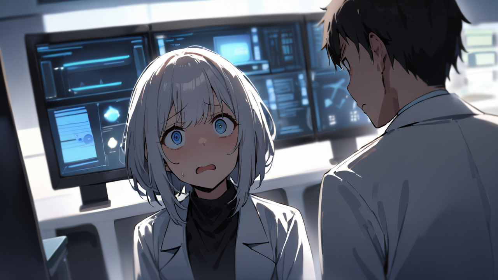
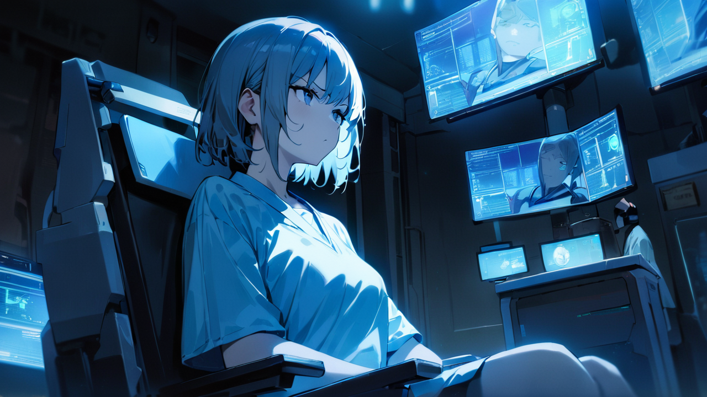

# 1화: 기억 관리사

## Scene 2: 예상치 못한 재회

"다음은 서하린 씨."

측정실 문이 열리는 순간, 내 동공이 크게 확장된다.  
시간이 멈춘 것만 같다.  
푸른 조명 아래 기억 거래소 상급 관리사, 강민준이 서 있다.  
1년 전 내가 모든 것을 걸었던 그 사람.

[측정실 3-B]  
[담당 관리사: 강민준]  
[등급: 상급 / 위험기억 처리 자격]  
[특기: 기억 안정화]

입구의 전자 패널이 그의 정보를 표시한다.  
숨을 들이킨다.  
아직도 낯익은 그의 옆모습.  
단정하게 빗어 넘긴 머리카락, 깔끔한 흰 셔츠, 왼손 약지의 희미한 반지 자국까지...  
1년이라는 시간이 무색하게 모든 것이 선명하다.

'여기서 만날 줄은...'

심장이 미친 듯이 뛴다.  
귓가에서 피가 쿵쿵 울린다.  
손끝이 차갑게 얼어붙는다.

[공명도: 87/100 (급상승)]  
[기억 안정도: 32/100 (위험)]  
[정신력: 75/100 (급감)]

민준의 책상 위에는 [오늘의 기억 처리량: 47건]이라는 수치가 떠 있다.  
오전 10시가 채 되지 않은 시간에 이미 일반 관리사의 하루 할당량을 넘긴 숫자다.

"...들어오세요."

민준의 목소리는 서류만 보며 건조하다.  
마치 처음 보는 사람을 대하듯.  
그 무심함이 오히려 가슴을 더 아프게 한다.  
예전의 그는 항상 내 이름을 부드럽게, 마지막 음절을 살짝 올려 부르곤 했었는데.

'알아보지 못하는 건가... 아니면...'

천천히 측정실로 들어선다.  
다리가 후들거린다.  
자연스럽게 행동해야 한다는 것을 알면서도, 내 몸은 공포와 기대와 슬픔이 뒤섞인 이상한 감정에 휩싸인다.

"기억 품질 측정을 시작하겠습니다. 의자에 앉으세요."

측정 의자는 마치 병원의 치과 의자같다.  
차가운 메탈 프레임에 딱딱한 등받이.  
자리에 앉자 민준이 다가온다.  
그의 손에서 기억 공명기가 푸르게 빛난다.  
1년 만의 근접한 거리.  
내 심장 소리가 들릴까 두렵다.

[기억 공명기 작동 준비]  
[사용자: 강민준]  
[모드: 신규 측정]  
[주의: 비정상 수치 감지 시 자동 알림]

"측정 중에는 특별한 기억에 집중하지 마세요. 수치에 영향을 줄 수 있습니다."

고개를 끄덕인다.  
하지만 이미 늦었다.  
민준의 체향이 코끝을 스치는 순간, 억눌렀던 기억들이 물밀듯이 밀려온다.

첫 만남, 서툰 고백, 달콤했던 데이트, 작은 다툼들, 그리고... 마지막 이별.  
병원 앞에서 그가 했던 마지막 말.  
"이제 끝내요. 당신을 기억하고 싶지 않습니다."

'잊어야 해, 생각하지 마...'

등줄기를 타고 차가운 땀이 흐른다.  
쿵쾅거리는 심장이 온몸을 울린다.  
미간에 힘이 들어간다.  
아무것도 생각하지 말아야 한다는 것을 알지만, 머릿속은 이미 과거로 가득 차 있다.

"심박수가 불안정합니다."  
민준의 차가운 지적이 들린다.  
"진정하세요."

"네... 죄송합니다."

민준이 공명기를 내 관자놀이에 부착한다.  
차가운 감각이 스쳐 지나간다.  
그의 손끝이 스치는 순간, 내 모든 신경이 그 접점에 집중된다.

'제발, 아무것도 생각하지 말자.'  
'그날의 일은 잊자.'  
'지금은...'

삐- 삐- 삐-

날카로운 경고음이 울린다.  
민준의 표정이 굳어진다.  
모니터에 붉은 경고창이 뜬다.

[위험 수치 감지]  
[기억 공명도: 85/100]  
[일반인 평균: 40/100]  
[위험 등급 판정]  
[즉시 조치 필요]  
[상급 관리자 통보 요망]

"서하린 씨."

민준이 천천히 나를 바라본다.  
차가운 눈빛 속에 이해할 수 없는 감정이 스쳐 지나간다.  
마치 두려움과 흔들림이 뒤섞인 듯한.  
처음으로 그의 무표정에 균열이 생긴다.

"혹시... 일부러 그러신 겁니까?"

"네? 무슨 말씀이신지..."

심장이 더 빨리 뛴다.  
그가 알아본 걸까?  
나를 기억하는 걸까?  
아니면 단지 비정상적인 수치 때문에 의심하는 걸까?

"이런 비정상적인 공명도는 본 적이 없습니다."  
민준이 모니터를 다시 확인한다.  
그의 목소리가 미세하게 떨린다.  
"마치... 마치 누군가의 기억에 집착하고 있는 것처럼요."

내 얼굴이 창백해진다.  
민준의 말이 날카로운 화살처럼 내 마음을 관통한다.  
그가 알고 있을까?  
내가 이곳에 온 진짜 이유를.  
그의 기억 속에 남아있는 나를 찾고 싶었던 마음을.

[공명도: 92/100 (위험)]  
[기억 안정도: 25/100 (심각)]  
[정신력: 65/100 (급감)]  
[상태: 감정 동요 상태]

"앞으로 당신은 제 직속 관리하에 들어갑니다. 일반 교육과정은 받을 수 없어요."

"왜...죠?"

목소리가 떨린다.  
그에게 들키고 싶지 않은데, 내 감정이 목소리로 다 드러나는 것 같다.

"위험 등급입니다."  
민준의 목소리가 더욱 차갑게 변한다.  
마치 얼음장처럼.  
"당신의 공명도는 위험 기억에 쉽게 감염될 수 있다는 뜻이에요. 동시에..."  
그의 목소리가 낮아진다.  
"타인의 기억에 깊이 공감할 수 있다는 의미이기도 하죠."

내 손을 바라본다.  
떨리고 있다.  
기억 공명제의 부작용이 아직도 가시지 않은 탓일까, 아니면 그를 마주한 충격 때문일까.

민준은 태블릿을 꺼내 무언가를 빠르게 입력한다.

[특별 관리 대상 지정]  
[담당자: 강민준]  
[사유: 비정상 공명도]  
[위험도: 상]  
[조치: 즉시 특별 교육 시행]

"특별 교육실로 오세요."  
민준이 문을 열며 말한다.  
"지금부터 당신의 진짜 교육이 시작됩니다."

'진짜 교육...?'

이제야 깨닫는다.  
내가 이곳에 온 진짜 이유를.  
어쩌면 그날의 기억을 되찾고 싶었던 게 아닐까.  
강민준과 함께했던 그 시간들을.  
그가 그토록 쉽게 지워버렸다는 그 기억들을.

하지만 지금 민준의 차가운 눈빛은, 모든 게 무의미했음을 말해주고 있다.  
그는 이미 나를 지워버린 지 오래인 것 같다.  
아니... 어쩌면 아직 완전히 지우지 못한 걸지도 모른다.  
그의 흔들리는 눈빛이 그것을 말해주고 있다.

[공명도: 95/100 (임계점)]  
[기억 안정도: 20/100 (극도로 불안정)]  
[정신력: 60/100 (위험)]  
[히든 스탯 - 진정성: 45/100 (발현 중)]

"시작하죠, 서하린 씨."  
민준이 특별 교육실 문을 닫으며 말한다.  
"당신의... 특별한 재능을 어떻게 다루어야 할지."

고개를 끄덕인다.  
이제 돌이킬 수 없는 선을 넘어선 것이다.  
그리고 어쩌면, 이것이 내가 진정으로 원했던 것일지도 모른다.  
잊혀진 줄 알았던 기억들을 마주하는 것.  
그리고 그 속에서 나를 다시 찾는 것.

특별 교육실의 문이 닫히며, 푸른 모니터 불빛만이 어둠 속에서 깜박인다.

[다음 화에 계속...]

