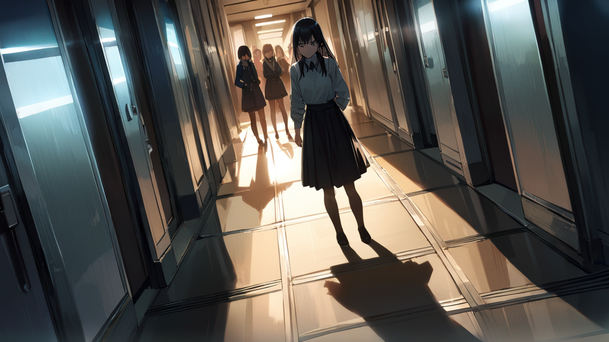
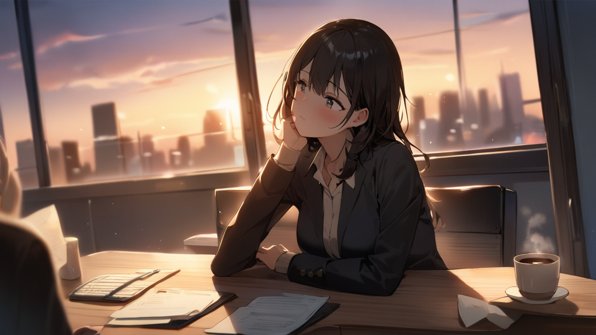

# 2화: 위험한 공감

## Scene 2: 위험한 재능

"하린 씨, 괜찮아요?"

퇴근 시간, 윤세아가 다가온다.  
아침부터 특별 교육을 받느라 내 얼굴은 지쳐 보인다.  
형광등 아래에서 내 피부는 창백하고, 눈가에는 피로의 그림자가 짙게 드리워져 있다.

[신입 관리사: 서하린]  
정신력: 23/100 (위험)  
기억 안정도: 45/100 (불안정)  
공명 피로도: 87% (매우 높음)  
권장 조치: 즉시 휴식

"네... 그냥 좀 피곤해서요."

손목에 떠오른 수치들을 무심코 가린다.  
하지만 세아의 날카로운 눈은 이미 그것을 알아챈 듯하다.  
S급 관리사의 관찰력을 피하기엔 역부족이다.

"강민준 관리사의 보고를 받았어요."  
세아가 자리에 앉으며 말한다.  
그녀의 목소리는 부드럽지만, 눈빛은 날카롭다.  
"95%의 공명도라니, 놀랍네요."

[S급 관리사 정보]  
이름: 윤세아  
등급: S급 (기억 치유 전문)  
특기: 위험 기억 안정화  
주요 업적: 집단 트라우마 해소 12건

고개를 숙인다.  
그것이 칭찬인지 우려인지 판단하기 어렵다.  
세아의 표정에는 복잡한 감정이 서려 있다.  
마치 오래된 기억을 떠올리는 듯한 그늘진 눈빛.

"사실..."  
세아가 목소리를 낮춘다.  
주변을 살피는 그녀의 눈빛이 비장하다.  
자동으로 켜져 있던 천장의 일부 조명이 꺼지고, 사무실은 어스름한 그림자에 잠긴다.  
"당신같은 케이스를 한 번 본 적이 있어요."

"정말인가요?"

[감정 변화 감지]  
대상: 윤세아  
주요 감정: 불안, 회한  
특이사항: 과거 기억 파편 감지  
위험도: 주의 필요

"5년 전이었죠. 비슷한 공명도를 가진 관리사가 있었어요."  
세아의 손가락이 무의식적으로 커피잔을 돌린다.  
식은 커피에서 희미한 증기가 오른다.  
"그녀는 위험 기억들을 놀라운 속도로 치유했죠.  
F등급부터 시작해서 한 달 만에 C등급까지... 모두가 천재라고 불렀어요."

세아의 표정이 어두워진다.  
그녀의 손가락이 무의식적으로 자신의 왼쪽 관자놀이를 만진다.  
그곳에 희미한 흉터가 보인다.  
마치 기억 공명기의 자국처럼.

[기억 흔적 감지]  
대상: 윤세아  
상태: 불안정한 기억 파편  
등급: B급 추정  
경고: 접근 금지  
특이사항: 강제 삭제 흔적

"결국 감정 전이를 이기지 못하고 쓰러졌어요.  
타인의 기억과 감정에 너무 깊이 동화된 나머지, 자신이 누구인지를 잃어버린 거죠.  
나중에는... 자신의 기억과 타인의 기억을 구분하지 못하게 됐어요."

등줄기가 서늘해진다.  
아까 본 기억 속 여자의 감정이 다시 한번 떠오른다.  
자신도 모르게 손바닥에 새겨진 손톱자국이 욱신거린다.

"그 관리사는 어떻게..."

"지금은 요양 중이에요."  

세아가 재빨리 말을 자른다.  
너무 빨랐다.  
마치 준비된 대답처럼.  

"그래서 드리는 말씀인데..."  

세아가 내 손을 잡는다.  
그녀의 손이 차갑다. 

"조심하세요. 당신의 재능은 양날의 검이에요.  
잘 다루면 놀라운 힘이 되겠지만, 그렇지 않으면..."

[경고: 기억 오염 위험]  
의심 대상: 5년 전 사건  
관련자: 불명  
주의: 관련 정보 접근 제한

"알겠습니다."

그때 복도 끝에서 임지현이 나타난다.  
형광등 불빛 아래 그녀의 실루엣이 길게 늘어진다.  
그녀는 나를 향해 날카로운 시선을 보낸다.  
하지만 그 눈빛 속에는 단순한 적의만이 아닌 다른 무언가가 숨어 있다.

[신입 관리사: 임지현]  
정신력: 95/100 (정상)  
기억 안정도: 35/100 (심각)  
특이사항: 기억 단절 현상  
비고: 6개월 전 기록 없음

"특별 교육은 잘 받으셨나요?"  
지현의 목소리에 가시가 돋아있다.  

"우리와 다른 대우를 받으시니 부럽네요."

"지현 씨..."

"하린 씨가 특별한 케이스라는 건 알지?"  
세아가 나서서 말한다.  
그녀의 목소리에는 미묘한 경계가 섞여 있다.  

"각자의 역할이 있는 법이에요."

"물론 알죠."  
지현이 비웃듯 말한다.  
그녀의 왼손이 무의식적으로 오른쪽 관자놀이를 긁는다.  
그곳에도 희미한 흉터가 있다. 

"비정상적으로 높은 공명도... 정말 대단하시네요."

지현이 돌아서려는 순간, 그녀의 눈에서 깊은 상처를 발견한다.  
마치 아까 본 기억 속 여자처럼 누군가에 대한 그리움과 상실감이 가득하다.  
하지만 이상하게도 그 감정이 흐릿하다.  
마치 지워진 기억처럼.

[기억 분석 결과]  
대상: 임지현  
- 감정: 상실감, 그리움, 분노  
- 특이사항: 감정-기억 불일치  
- 의심 사항: 강제 기억 조작  
경고: 더 이상의 감정 읽기 금지

"저기..."

내가 부르기도 전에 지현은 사라진다.  
검은 구두 소리가 복도를 따라 멀어진다.  
문득 깨닫는다.  
내 능력이 단순히 기억을 읽는 것이 아니라는 것을.  
사람들의 숨겨진 아픔까지 읽을 수 있다는 것을.  
그리고 그것이 얼마나 위험한 일인지도.

"내일부터 본격적인 훈련이 시작될 거예요."  
세아가 말한다.  
그녀의 눈빛이 복잡하다.  
마치 내 미래를 걱정하는 듯, 또는 자신의 과거를 떠올리는 듯한 표정이다. 

"준비되셨나요?"

[특별 교육 일정 확정]  
내일 09:00 - 위험등급 D 기억 처리 실습  
담당: 강민준  
장소: 특별 교육실 3-B  
주의사항: 정신력 완전 회복 필수  
특별 지시: 이상 징후 발생 시 즉시 중단

조용히 고개를 끄덕인다.  
이제 돌이킬 수 없는 길에 들어선 것이다.  
타인의 기억과 감정을 읽는 위험한 여정이 시작되었다.  
그리고 어쩌면, 그 끝에는 내가 모르는 진실이 기다리고 있을지도 모른다.

사무실의 마지막 불이 꺼진다.  
창 밖으로 기억 거래소의 푸른 네온사인이 깜빡인다.  
오늘도 수많은 기억들이 저장되고, 읽히고,  
그리고... 지워지고 있다.

