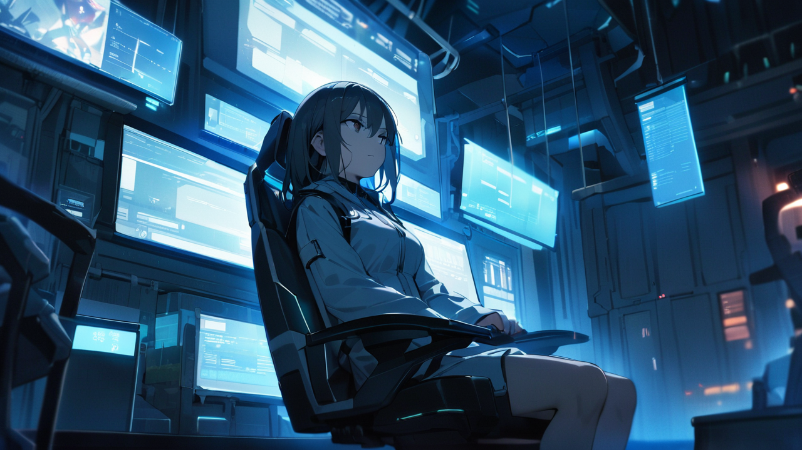
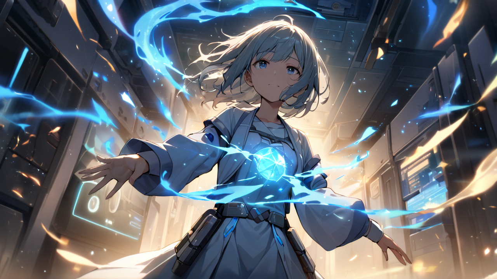
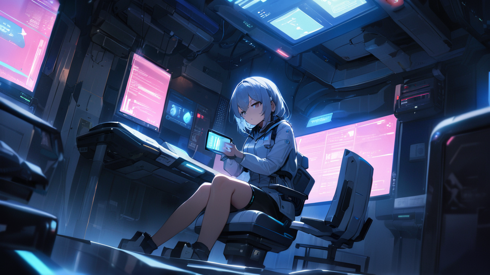

# 3화: 기억의 무게

## Scene 1: 첫 시험

특별 교육실의 모니터에 빨간 경고등이 깜빡인다.  
[위험등급 D] 기억 카드가 내 손에서 미세하게 떨린다.  
이전의 F등급과는 완전히 다른 무게감이 느껴진다.  
마치 누군가의 고통이 실체가 되어 카드에 담긴 것처럼.

[기억 정보 분석]  
등급: D (위험도 ★★★)  
유형: 중간 수준 트라우마  
예상 정신력 소모: 30  
권장 공명 시간: 15분  
주의: 감정 전이 위험 높음  
특이사항: 영구 손상 가능성 5%

"오늘은 실전입니다."  
강민준이 기억 공명기를 점검하며 말한다.  
그의 손가락이 평소보다 꼼꼼하게 장비를 확인한다.  

"D등급은 중간 수준의 트라우마를 다루는 단계예요.  
피험자의 심각한 배신이나 상처가 담긴..."

민준의 목소리가 잠시 흔들린다.  
그의 표정에서 스치는 그림자를 놓치지 않는다.  
마치 자신의 기억을 떠올리는 듯한 그 순간의 동요.  
그의 손가락이 무의식적으로 공명기의 전원 버튼을 몇 번이고 만진다.

[강민준 상태 분석]  
심박수: 미세 상승 (76→82)  
음성 패턴: 불안정 (2.3초 간격 끊김)  
특이사항: 기억 반응 흔적  
신경성 행동: 반복적 장비 확인  
경고: 감정 읽기 자제 필요

"이번 기억은 특별히 선별된 케이스입니다."  
민준이 목소리를 가다듬는다.  
그가 모니터를 향해 몸을 돌린다.  
그의 긴장된 등선을 바라본다. 

"당신의 공명도를 시험하기에 적합한...  
아니, 어쩌면 위험할 수도 있는 기억이에요."

자신도 모르게 입술을 깨문다.  
어제의 95% 공명도가 떠오른다.  
윤세아의 경고도 아직 생생하다.  
'자신을 잃을 수도 있다'는 그 말.  
마치 그 말을 증명하려는 듯, 뒷목이 저리고 관자놀이가 지끈거린다.

[하린 상태 점검]  
정신력: 98/100 (충분)  
기억 안정도: 75/100 (양호)  
공명 피로도: 12% (낮음)  
신체 상태: 경미한 두통  
컨디션: 최적 (경고 수준 미달)

"기억 공명 준비 단계입니다."  
민준이 모니터 앞에서 일련의 명령어를 입력한다.  
화면에 복잡한 그래프들이 떠오른다.  

"이번엔 조금 다른 접근법을 시도해보겠습니다.  
하린 씨의 특별한 공명 능력을 고려해서..."

[시스템 설정 변경]  
기본 모드 → 고급 분석 모드  
안전장치: 2중 잠금  
비상 차단: 자동 설정  
임계값: 85% (기존 70%에서 상향)

"준비되셨나요?"

고개를 끄덕이자 민준이 기억 공명기를 작동시킨다.  
차가운 금속이 관자놀이에 닿는 순간, 세상이 흐려지기 시작한다.  
이번에는 F등급과는 다른 차원의 어지러움이 밀려온다.  
마치 깊은 물속으로 빨려 들어가는 것 같은 감각.

[기억 공명 시작]  
대상: 28세 남성  
시점: 2년 전  
유형: 연인 관계 단절  
주의: 강한 감정 잔향  
진행률: 12%...35%...58%

순간 강렬한 감정이 밀려든다.  
분노, 배신감, 그리고 깊은 후회.  
한 남자가 아파트 화재 현장에서 무언가를 찾고 있다.  
검은 그을음 사이로 비상등이 번쩍인다.  
그의 떨리는 손에는 반지가 들려있다.  
백금 소재의 심플한 커플링.  
내부에는 'Forever Yours'라는 문구가 새겨져 있다.

[생체 신호 변화]  
심박수: 82 → 95 → 103  
혈압: 지속 상승  
공명도: 67% 진행  
호흡: 불규칙 (주의 필요)  
경고: 임계점 접근 중

"안정도가 떨어지고 있어요!"  
민준의 경고가 들린다.  
그의 목소리가 마치 물속에서 들리는 것처럼 왜곡되어 있다. 

"감정에 휩쓸리지 마세요.  
이번엔 다르게 접근해보세요.  
당신만의 방식으로..."

깊게 숨을 들이마신다.  
기억 속 남자의 감정이 마치 파도처럼 밀려온다.  
하지만 이번에는 달라야 한다.  
감정을 읽되, 거리를 두어야 한다.  
마치 책을 읽듯이, 영화를 보듯이.  
의식을 한 걸음 뒤로 물려본다.

"진정하세요."  
속삭인다.  
내 목소리가 기억 속으로 스며든다.  
마치 빛이 어둠을 가르듯.  

"당신의 기억이지만...  
지금은 제가 도와드릴 차례예요.  
이 순간을 함께 견뎌낼 수 있어요."

놀랍게도 기억 속 남자의 떨림이 잦아든다.  
그의 손에 쥐어진 반지가 마지막으로 한번 빛나더니, 주머니 속으로 사라진다.  
안정도 수치가 서서히 올라가기 시작한다.

[안정화 진행 중]  
기억 안정도: 45% → 67% → 82%  
감정 잔향: 급격히 감소  
예상치 못한 반응: 기억 주체와의 교감 확인  
특이사항: 새로운 안정화 패턴 발견  
주목: 기존 사례에 없는 접근법

"놀랍네요."  
민준이 모니터를 확인하며 말한다.  
그의 목소리에서 처음으로 진짜 감탄이 묻어난다. 

"보통은 일방적으로 기억을 진정시키려고 하는데...  
당신은 마치 대화하듯 안정화시키고 있어요. 이런 방식은..."

"그냥... 그게 맞는 것 같아서요."  
목소리가 흔들린다.  
아직도 그 남자의 마지막 감정이 희미하게 남아있다.  
포기와 체념, 그리고 그 밑바닥에 깔린 작은 희망 같은 것.

"이런 접근법은 처음 봅니다."  
민준의 손가락이 키보드 위에서 빠르게 움직인다.  
새로운 데이터를 기록하는 소리가 들린다.  

"어쩌면 당신의 높은 공명도가 오히려 장점이 될 수도 있겠네요.  
우리가 미처 생각하지 못한 방식으로..."

[안정화 완료]  
성공률: 89% (최상위 5% 기록)  
소요 시간: 12분 (목표시간 대비 -3분)  
정신력 소모: 27 (예상치 대비 -3)  
특이사항: 새로운 안정화 패턴 발견  
권장: 패턴 분석 및 기록 보관

희미하게 미소 짓는다.  
처음으로 내 '비정상적인' 능력이 누군가에게 도움이 된 것 같다.  
어쩌면 이것이 내 진짜 재능일지도 모른다는 생각이 든다.

"이제 기억을 빠져나오세요."  
민준의 목소리가 들린다.  
이전과는 다른, 부드러운 톤이다.  

"천천히... 현실로 돌아오세요.  
서두르지 말고, 자연스럽게..."

눈을 떴을 때, 특별 교육실의 푸른 불빛이 눈에 들어온다.  
어제와는 다른 느낌이다.  
마치 새로운 가능성을 발견한 것 같은.  
아니, 어쩌면 진정한 내 모습을 발견한 것 같은.

"오늘은 여기까지입니다."  
민준이 말한다. 

"내일은..."

그때 갑자기 문이 열린다.  
임지현이다.  
그녀의 표정이 평소와 달리 창백하다.  
마치 오래 숨겨온 비밀을 더 이상 감추지 못하겠다는 듯한 절박함이 얼굴에 가득하다.

"민준 선배... 제 기억을..."  
지현의 목소리가 떨린다.  
그녀의 손이 문틀을 꽉 쥐고 있다.

"제 잃어버린 기억을 찾아주실 수 있나요?"

공기가 얼어붙는 것 같다.  
민준의 표정이 순식간에 굳어진다.  
방금 전까지 보였던 부드러움은 온데간데없이 사라진다.

[이상 감지]  
대상: 임지현  
상태: 극도의 불안정  
기억 안정도: 25/100 (위험)  
감정 상태: 임계점 초과  
즉시 조치 필요

"지현 씨..."

지현의 눈에서 절박함을 읽는다.  
마치 익사 직전의 사람처럼 무언가를 붙잡으려는 듯한 그 눈빛.  
그리고 그 눈빛 속에 숨겨진, 또 다른 기억의 흔적들.

특별 교육실의 모니터가 붉은 빛을 발한다.  
이번에는 다른 종류의 위험이 시작되려는 것 같다.  
내 능력이 다시 한번 꿈틀거리는 것을 느낀다.  
지현의 잃어버린 기억을 향해.

