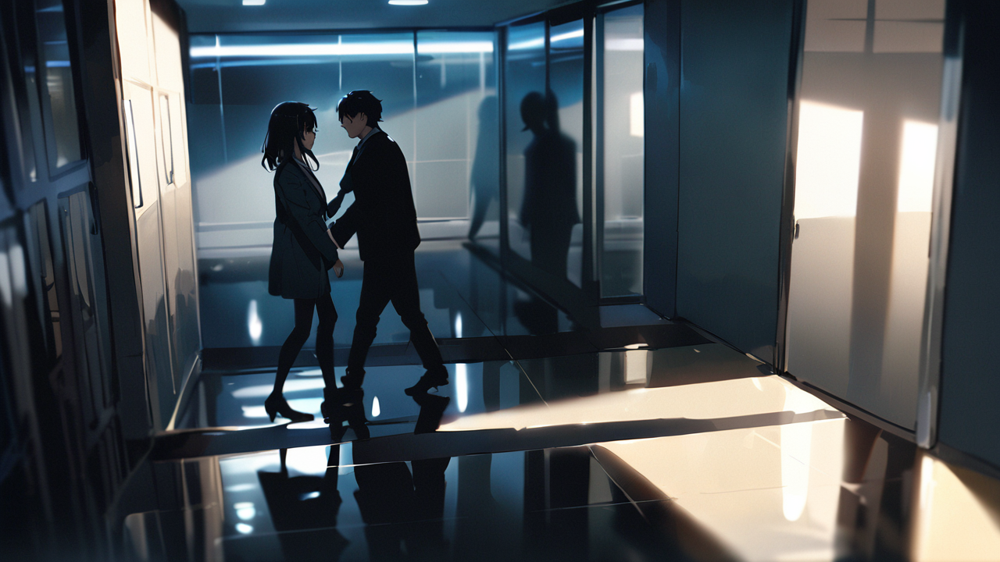
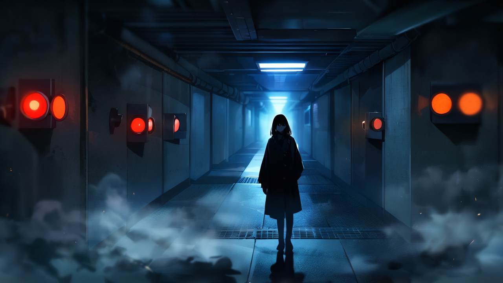

# 3화: 기억의 무게

## Scene 2: 숨겨진 진실

특별 교육실의 공기가 무거워진다.  
임지현의 갑작스러운 등장과 요청은 마치 폭탄과도 같다.  
형광등 불빛이 그녀의 창백한 얼굴을 비춘다.  
관자놀이의 희미한 흉터가 푸르스름하게 빛난다.

[다중 상태 분석]  
임지현  
- 심박수: 비정상 상승 (115)  
- 기억 안정도: 25/100 (위험)  
- 감정 상태: 극도의 불안/절박  
- 신체 반응: 과호흡 징후  
- 특이사항: 비정상적 기억 파동

강민준  
- 표정 경직 (스트레스 지수 ↑)  
- 미세 동작: 방어적  
- 호흡: 불규칙  
- 특이사항: 숨겨진 긴장  
- 주목: 왼손 주머니의 불특정 물체 반복 확인

순간적으로 강민준의 표정 변화를 놓치지 않는다.  
그의 왼손이 무의식적으로 주머니 속 무언가를 만지작거린다.  
비상 정지 장치일까?  
아니면 다른 무언가?

[기억 거래소 보안 프로토콜]  
Level 1: 일반 접근 제한  
Level 2: 기억 안정화 시도  
Level 3: 강제 기억 차단  
Level 4: 긴급 격리  
Level 5: [데이터 접근 불가]

"그건 불가능합니다."  
민준의 목소리가 차갑다.  
너무 차갑다.  
마치 누군가가 미리 녹음해둔 것처럼 기계적이다. 

"기억 거래소는 잃어버린 기억을 찾아주는 곳이 아닙니다."

"하지만..."  
지현의 목소리가 떨린다.  
그녀의 손가락이 문틀을 파고든다.  
마디가 하얗게 변할 정도로. 

"6개월 전, 그날의 기억만큼은...  
제가 무슨 일을 겪었는지만이라도..."

[기억 분석 시도]  
대상: 임지현  
시점: 6개월 전  
상태: 강제 차단됨  
접근 등급: A (최고 위험)  
경고: 접근 시도 감지됨  
주의: 시도자 - 서하린  
위험: 즉각 중단 필요

순간적으로 지현의 감정을 읽으려 한다.  
그러나 이상하게도 막혀있다.  
마치 누군가가 의도적으로 차단해놓은 것처럼.  
아니, 그보다 더 이상한 건 그녀의 감정이 마치 모자이크 처리된 것처럼 불완전하다는 것.  
일부는 선명한데, 일부는 완전히 지워져 있다.

"임지현 씨."  
민준이 한 걸음 앞으로 나선다.  
그의 목소리에 미세한 떨림이 있다. 

"당신의 기억은 특수한 케이스입니다.  
A등급으로 분류되어 있어요.  
접근이 철저히 금지된..."

"A등급이요?"  
무심코 내뱉는다.  

A등급.  
정부 지정 위험 기억.  
접근 시 영구적 손상 위험이 있는 최고 등급.  

하지만 민준의 말은 뭔가 이상하다.  
애초에 A등급 기억의 존재 자체가 일반 관리사들에게는 알려지지 않은 비밀이었을 텐데.

[위험 등급 정보 표시]  
A등급 기억  
- 정부 관리 대상  
- 접근 권한: 최고 등급 필요  
- 위험도: ★★★★★  
- 경고: 기억 왜곡/오염 위험  
- 특이사항: [데이터 삭제됨]  
- 주의: 존재 자체 기밀 사항

지현의 눈빛이 흔들린다.  
눈물이 그녀의 눈가에 맺혔다가 사라진다.  

"그럼 윤세아 팀장님은요?  
S급 관리사라면...  
팀장님이라면 가능하지 않을까요?"

"안됩니다." 

복도에서 들려온 목소리.  
윤세아다.  
그녀의 표정은 평소의 따뜻함이 사라져있다.  
오히려 어딘가 두려워 보이기까지 하다.

[관리자 감지]  
이름: 윤세아  
등급: S급  
현재 상태: 경계/긴장/공포  
특이사항: 비정상적 기억 파동  
주목: 5년 전 사고와 연관성 의심  
경고: 더 이상의 분석 위험

"임지현 씨, 제 사무실로 오세요."  
세아의 목소리에는 타협의 여지가 없다. 

"지금 당장."

지현은 잠시 망설인다.  
그녀의 손이 떨리고 있다.  

"저는 그저... 알고 싶었을 뿐인데...  
그날, 병원에서 깨어났을 때... 모든 게 달라져 있었어요.  
제 기억, 제 감정, 심지어는 제가 누구인지조차..."

순간 강한 충동을 느낀다.  
지현의 기억을 읽고 싶다.  
저 막혀있는 6개월의 공백을, 그녀의 상실된 시간을 보고 싶다.  
그리고 그 순간, 예상치 못한 일이 일어난다.

[비정상 감지]  
대상: 서하린  
현상: 무단 공명 시도  
공명도: 급상승 (82%→93%)  
경고: 위험 수준 접근  
주의: 기억 감염 가능성

희미하게, 아주 희미하게 무언가가 보인다.  
하얀 병실, 새하얀 가운을 입은 의사들, 그리고 붉은 경고등이 번쩍이는 수술실.  
파편적인 이미지들이 스쳐 지나간다.  
그리고 마지막으로, 누군가의 절규.

"하린 씨!"  
민준이 날카롭게 부른다.  
그가 내 어깨를 강하게 잡는다. 

"절대 시도하지 마세요.  
당신의 능력으로는 감당할 수 없어요. 이건..."

세아가 지현의 어깨를 잡는다.  
그녀의 손이 미세하게 떨리고 있다. 

"가시죠."

두 사람이 사라진 후, 특별 교육실에는 무거운 침묵이 내려앉는다.  
민준을 바라본다.  
그의 표정에서 무언가를 숨기고 있다는 것이 분명히 느껴진다.  
아니, 어쩌면 모두가 무언가를 숨기고 있는 것인지도 모른다.

[의심 정보 감지]  
주요 의문점:  
- 6개월 전 사건의 실체  
- A등급 기억의 존재 목적  
- 관리자들의 숨겨진 지식  
- 윤세아의 과거 사고와의 연관성  
경고: 추가 조사 시 심각한 위험

"선배님..."

"묻지 마세요."  
민준이 차갑게 말을 자른다.  
그의 눈빛이 흔들린다. 

"알면 안 되는 일이 있습니다.  
당신을... 당신을 위해서라도."

입술을 깨문다.  
머릿속이 복잡하다.  
지현의 잃어버린 기억, 그것을 막으려는 관리자들의 태도,  
A등급이라는 미스터리한 존재, 그리고 방금 스쳐 지나간 그 희미한 이미지들까지.

"오늘 교육은 여기까지입니다."  
민준이 기억 공명기를 정리하며 말한다. 

"내일은 C등급을 시도해볼 예정이에요."

자리에서 일어난다.  
머리가 지끈거린다.  
아까의 D등급 기억 처리도 있었지만,  
그보다는 지현의 잃어버린 기억을 읽으려 했을 때의 반동이 더 크다.  
마치 뇌 속의 무언가가 타버린 것처럼 아프다.

[하린 상태 체크]  
정신력: 71/100 (피로)  
기억 안정도: 55/100 (동요)  
공명 충동: 여전히 높음  
신체 상태: 두통/어지러움  
권장: 즉시 휴식

복도를 걸어 나오는데 어지러움이 밀려온다.  
잠시 벽에 기대어 서야 한다.  
차가운 벽의 감촉이 그나마 정신을 붙잡아주는 것 같다.

"괜찮으세요?"

민준이 다가온다.  
그의 목소리에서 처음으로 진짜 걱정이 묻어난다.  
아니, 어쩌면 두려움이었을지도 모른다.

"네... 그냥 좀 피곤해서..."

"오늘 많은 걸 보셨죠."  
민준이 한숨을 쉰다.  
그의 어깨가 무겁게 처져있다. 

"때로는 보지 말아야 할 것들도 있습니다.  
기억 관리사의 첫 번째 규칙이에요."

고개를 들어 민준을 바라본다.  
"그럼 두 번째 규칙은요?"

잠시 침묵이 흐른다.  
민준의 눈빛이 복잡하게 흔들린다.  
마치 오래된 고민을 떠올리는 듯한 표정이다.

"...알아서는 안 될 것을 알게 됐을 때,"  
그가 낮은 목소리로 말한다. 

"그것을 지켜야 한다는 겁니다. 어떤 대가를 치르더라도..."

[강민준 감정 분석]  
현재: 갈등/고민/보호본능  
특이점: 과거의 선택에 대한 후회  
경고: 더 이상의 감정 읽기 위험  
주의: 강제 기억 차단 가능성

무언가를 말하려다 멈춘다.  
민준의 말이 마치 경고처럼 들린다.  
아니, 어쩌면 애원에 가까웠는지도 모른다.  
지금 이 순간, 그가 나를 보호하려 하는 건지,  
아니면 무언가를 숨기려 하는 건지 알 수 없다.

"내일 뵙겠습니다."

돌아서려는 순간, 민준이 부른다.

"서하린 씨."

"네?"

"당신의 능력은... 축복일 수도 있고, 저주일 수도 있습니다."  
그의 목소리가 무겁게 가라앉는다.  
마치 오래전 자신의 선택을 후회하는 것처럼. 

"선택은 당신의 몫이에요. 하지만...  
모든 선택에는 대가가 따르니까요."

대답하지 않는다.  
그저 고개를 끄덕이고 걸음을 옮긴다.  
머릿속에서는 여전히 지현의 기억 파편이 맴돈다.  
하얀 병실, 붉은 경고등, 그리고 누군가의 절규.

복도 끝에서 기억 거래소의 푸른 네온사인이 깜빡인다.  
오늘도 수많은 기억들이 저장되고, 읽히고, 그리고 지워지고 있다.  
그리고 어쩌면, 그중에는 절대로 찾아서는 안 될 기억도 있을 것이다.

[기억 잔향 감지]  
위치: 지하 보관소 방향  
상태: 미약한 파동  
유형: 억제된 기억들의 반응  
강도: 측정 불가  
주의: 접근 금지 구역

발걸음을 멈추고 고개를 돌린다.  
복도 끝, 지하로 이어지는 계단 입구에서 희미한 진동이 느껴진다.  
마치 오랫동안 닫혀있던 문 너머에서 누군가가 속삭이는 것처럼.

"지하는... 접근 금지 구역입니다." 

민준의 목소리가 다시 차갑게 변한다.  
하지만 이미 알고 있다.  
내가 그 금지된 기억을 향해 한 걸음씩 다가가고 있다는 것을.  
그리고 언젠가는, 그 문을 열게 될 것이라는 것도.

[다음 화에 계속...]

