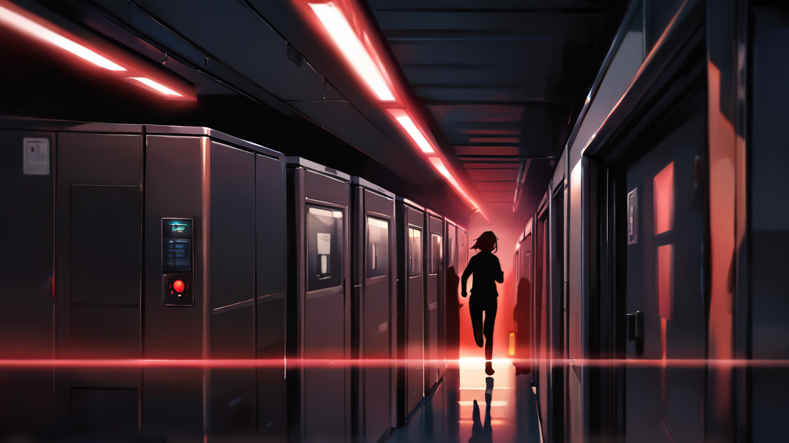
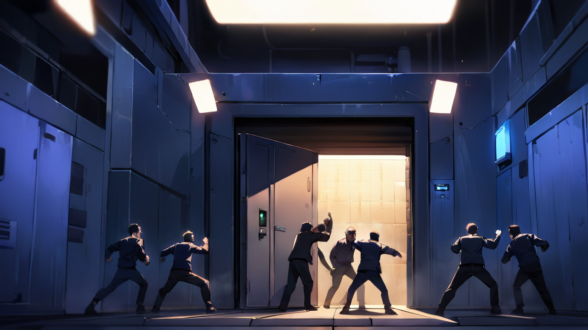
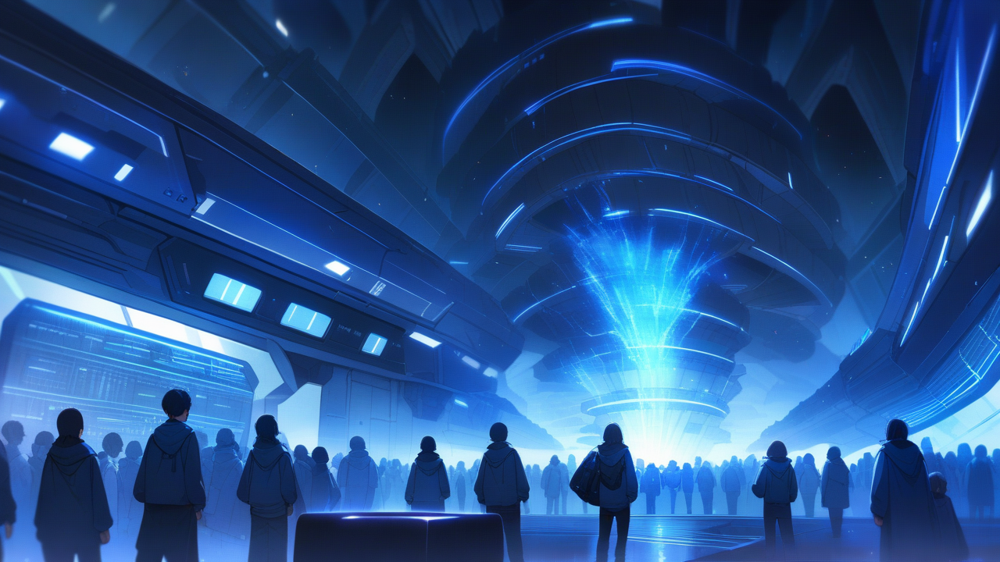

# 4화: 위험한 동조

## Scene 2: 금지된 구역

붉은 경고등이 복도를 물들인다.  
마치 혈관을 타고 흐르는 피처럼 붉은 빛이 건물 전체로 퍼져나간다.  
민준의 표정이 순식간에 굳어진다.  
그가 재빨리 통신기를 켠다.

[긴급 상황 발생]  
위치: 지하 3층 A구역  
상황: 비인가 접근 시도  
위험도: 최고 등급 / 즉시 대응  
필요 조치: 즉각 차단/격리  
경고: 기억 오염 위험 / 확산 가능성  
비상 코드: RED-A113

"윤세아 팀장님!"  
민준이 다급하게 외친다.  
통신기에서 지직거리는 노이즈가 흘러나온다. 

"지하에서 접근 시도가... A구역이..."

통신기 너머로 윤세아의 날카로운 목소리가 들린다.  
평소의 차분함은 온데간데없다. 

"알고 있어요. 임지현이... 임지현이 사라졌어요.  
감시 카메라가 멈췄고, 보안 시스템도 무력화됐어요.  
그녀가... 그녀가 기억해낸 것 같아요."

심장이 덜컥 내려앉는다.  
어제의 그 절박한 눈빛이 떠오른다.  

'제 잃어버린 기억을 찾아주실 수 있나요?' 
그녀의 마지막 말이 의미심장하게 울린다.  
그때 이미 그녀는 계획하고 있었던 걸까?

[보안 시스템 상태]  
- 감시 카메라: 오프라인  
- 출입 통제: 무력화  
- 비상 전원: 65% remaining  
- 격리 장치: 부분 작동  
- 경고: 다중 시스템 장애

"하린 씨, 여기서 기다리세요."  
민준이 문 쪽으로 움직인다.  
그의 움직임이 평소보다 더 긴장되어 보인다.  
"절대 밖으로 나가면 안 됩니다.  
이건... 우리가 예상했던 것보다 더 위험한 상황이에요."

그때였다.  
갑자기 모든 불이 꺼진다.  
비상등만이 희미하게 깜빡인다.  
마치 심장 박동처럼 일정한 간격으로.  

순간적으로 강한 기억 파동을 느낀다.  
마치 거대한 슬픔과 분노가 지하에서 올라오는 것 같다.  
생생한 감정이 파도처럼 밀려온다.

[비정상 감지]  
기억 파동 강도: 위험 수준 / 급상승  
발생원: 지하 3층 A구역  
범위: 확산 중 (반경 30m→50m)  
특이점: A등급 기억 반응 / 다중 파동  
경고: 감염 위험 극대 / 차단 실패  
영향: 정신력 교란 현상 발생

"가지 마세요."  
민준의 팔을 잡는다.  
손바닥에서 식은땀이 배어난다. 

"저도... 저도 가요.  
제 능력이 필요할지도 모르잖아요.  
방금 C등급도 안정화시켰잖아요."

민준이 잠시 망설인다.  
그의 눈빛이 복잡하게 흔들린다.  
마치 과거의 어떤 순간을 떠올리는 듯한 표정이다.  

"알겠어요. 하지만 제 뒤에서 절대 떨어지지 마세요. 그리고..."  
그가 주머니에서 작은 장치를 꺼낸다.  
검은색 금속 표면에 푸른 LED가 깜빡인다. 

"이건 비상용 정신력 차단기예요.  
위험하다 싶으면 바로 누르세요.  
지현 씨처럼...  
지현 씨처럼 되면 안 돼요."

둘은 서둘러 지하로 향한다.  
엘리베이터는 작동하지 않는다.  
비상계단을 따라 내려가는 동안 기억 파동이 점점 강해진다.  
관자놀이가 지끈거린다.  
마치 누군가가 머릿속을 망치로 두드리는 것 같다.

[다중 기억 파동 감지]  
유형 1: 임지현의 잃어버린 기억  
- 강도: 위험 수준  
- 성질: 불안정/혼란/분노  
- 상태: 급속 해동 중

유형 2: 6개월 전의 공백  
- 시점: 특정 불가  
- 범위: 광역  
- 특징: 강제 삭제 흔적

유형 3: 불명 기억파  
- 출처: 미확인  
- 성질: 극도로 불안정  
- 경고: 오염 위험도 최고

위험: 교차 감염 가능성 매우 높음  
즉각 대피 권장

지하 3층.  
평소에는 접근조차 금지된 구역이다.  
복도 끝에는 [A등급 기억 보관소]라는 표지가 붉게 빛나고 있다.  

마치 출혈하는 상처처럼 선명한 붉은빛.  
그리고 그 앞에 임지현이 서 있다.  
그녀의 실루엣이 비상등 불빛에 일그러져 보인다.

"지현 씨!"

부르려는 순간, 민준이 나를 막는다.  
그의 손이 차갑게 식어있다. 

"안돼요. 저 상태론... 
위험해요. 이미 기억 오염이 시작됐어요."

임지현이 천천히 돌아선다.  
그녀의 눈에서는 눈물이 흐르고 있다.  
하지만 그것은 보통의 눈물이 아니다.  

푸르스름한 빛을 띠는, 마치 기억이 흐르는 것 같은 눈물.  
뺨을 타고 흐르는 자국에서 미세한 전류가 일렁인다.

"이제 알겠어요..."  
지현의 목소리가 떨린다.  
그녀의 목소리에 다른 목소리가 겹쳐 들린다.  
마치 여러 사람이 동시에 말하는 것처럼. 

"왜 제 기억을 지웠는지...  
왜 모두가 침묵했는지...  
그날 실험실에서 있었던 일을...  
그리고 제가 목격한 것을..."

[위험 상황]  
대상: 임지현  
상태: 기억 오염 진행 중 (71%)  
증상: 강제 기억 회귀 / 다중 인격화  
정신력: 25/100 (위험)  
신체 상태: 심각한 부정합  
경고: 즉시 격리 필요  
카운트다운: 300초

"돌아가세요."  
민준이 한 걸음 앞으로 나선다.  
그의 목소리가 단단하지만, 손끝은 미세하게 떨리고 있다. 

"아직 늦지 않았습니다.  
당신을 위해서라도...  
우리 모두를 위해서라도..."

"날 위해서?"  
지현이 비웃듯 말한다.  
그녀의 웃음소리가 복도를 울린다.  
마치 깨진 유리가 부서지는 것 같은 날카로운 울림. 

"날 위해서 내 기억을 지웠다고요?  
내 존재 자체를 부정했다고요?  
그들이...  
그들이 한 짓을 덮기 위해서..."

그때였다.  
보관소의 문이 열린다.  
마치 오랫동안 닫혀있던 봉인이 깨지는 것처럼 둔중한 소리와 함께.  

푸른 빛이 쏟아져 나온다.  
마치 액체처럼 흐르는 차가운 빛.  
그리고 그 속에서 기억들이 흘러나온다.  
마치 살아있는 것처럼 움직이는 푸른 실타래들.  
금지된 진실들의 춤.

"하린 씨, 차단기를!"  
민준이 외친다.  
그의 목소리가 절박하다. 

"지금 당장...!"

하지만 내 손가락은 차단기 버튼 위에서 멈춰있다.  
공명 능력이 지현의 기억 파동에 반응하기 시작한다.  
그리고 그 속에서 무언가가 보인다.  
6개월 전, 지하 실험실에서 있었던 진실의 조각들이.

[내 상태 분석]  
공명도: 87% → 92% → 97% (급상승)  
정신력: 78/100 (감소 중)  
기억 안정도: 45/100 (불안정)  
감정 상태: 충격/호기심/두려움  
특이사항: 자발적 공명 시도  
경고: 위험 수준 접근

'이건... 믿을 수 없어...'

지현의 기억에서 무언가 끔찍한 진실이 드러나려는 것을 직감한다.  
기억 파동이 점점 강해지고, 푸른 빛이 더욱 선명해진다.  
민준의 다급한 목소리, 지현의 공포에 찬 눈빛,  
그리고 열린 보관소에서 흘러나오는 금지된 기억들.

선택의 순간이다.  
차단기를 누르고 모든 것을 중단할 것인가,  
아니면... 그 모든 진실을 마주할 것인가.  
손가락이 차단기 버튼 위에서 떨린다.  
모든 것이 슬로우 모션처럼 느려진다.

'난 알아야 해. 우리 모두 알아야 해...'

마침내 손을 내린다.  
차단기를 누르지 않기로 한 결정.  
그리고 그 순간, 기억의 홍수가 밀려온다.  
내 공명 능력이 열린 보관소와 지현의 잃어버린 기억에 완전히 공명하기 시작한다.

[위험 임계점 돌파]  
공명도: 100% 초과  
경고: 통제 불능 상태  
정신력: 급격히 감소 중  
주의: 의식 소실 위험  
긴급: 즉각 조치 필요  
카운트다운: 180초

"하린 씨, 안돼요!"  
민준의 목소리가 멀어진다. 

"그건 누구도 감당할 수 없는...!"

하지만 이미 늦었다.  
의식이 기억의 파도에 휩쓸린다.  
푸른 빛이 시야를 가득 채우고, 머릿속에 수많은 이미지들이 홍수처럼 밀려든다.  
낯선 실험실, 고통에 찬 비명소리,  
그리고 흰 가운을 입은 사람들의 모습이 번갈아 떠오른다.

[공명도: 103% (한계치 초과)]  
[정신력: 62/100 (위험)]  
[기억 안정도: 30/100 (심각)]  
[경고: 기억 오염 진행 중]  
[주의: 의식 붕괴 위험]

민준의 목소리가 점점 더 멀어진다.  
대신 들리는 것은 낯선 목소리들,  
실험 데이터를 읽는 차가운 목소리,  
통제를 외치는 명령,  
그리고 그 밑에 깔린 고통스러운 신음소리.

지하 실험실의 모습이 점점 더 선명해진다.  
강제로 추출되는 기억들,  
푸른 빛으로 빛나는 기억 저장 장치,  
그리고 그것을 지켜보는 차가운 눈빛들.

세상이 일그러지기 시작한다.  
내 의식과 지현의 기억, 그리고 보관소에서 흘러나온 수많은 A등급 기억들이 뒤섞인다.  
어디가 시작이고 어디가 끝인지 구분할 수 없는 혼돈의 소용돌이.

'이건... 진실이야...'

마지막 순간, 의식이 완전히 사라지기 직전,  
내 안에서 무언가가 깨어난다.  
모든 것을 품을 수 있는 거대한 의식,  
기억의 파도를 받아들이고 정화할 수 있는 어떤 능력.

[새로운 능력 발현]  
[히든 스탯 - 기억 제어력: 65/100 (각성)]  
[공명도: 105% (안정화 시도 중)]  
[특이 현상: 기억 구조화 시작]

고통스러운 현기증 속에서 마지막으로 보이는 것은 놀란 표정의 민준,  
푸른 눈물을 흘리는 지현,  
그리고 열린 보관소에서 쏟아져 나오는 금지된 진실들의 홍수.

세상이 완전히 푸르게 변하고, 의식이 서서히 어둠 속으로 가라앉는다.

[다음 화에 계속...]

