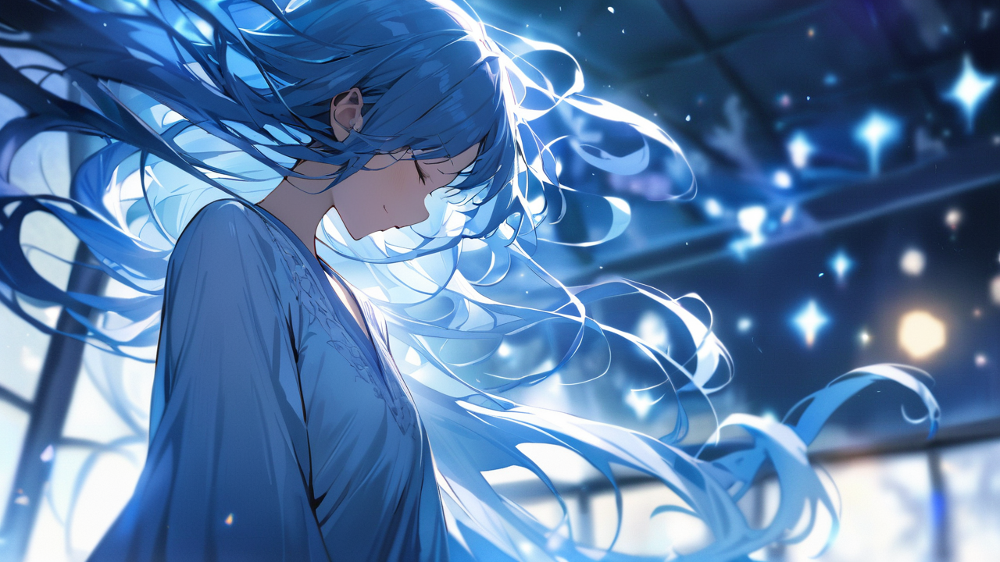
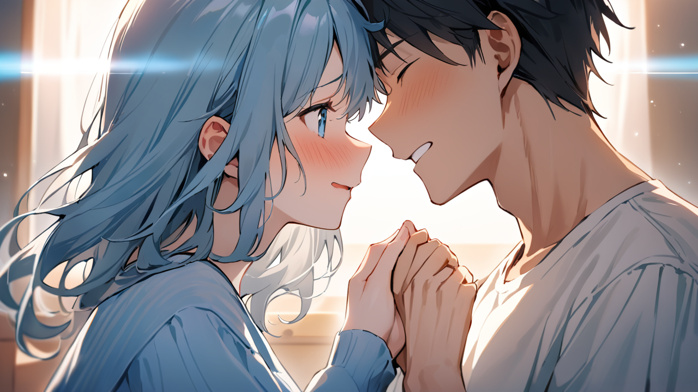

# 6화: 기억의 빛

## Scene 1: 새로운 시작

특별 교육실이 푸른 빛으로 물든다.  
공기 중에 떠도는 기억들이 나를 중심으로 모여든다.  
마치 자연스러운 이치를 찾아가듯, 마치 오랫동안 잃어버렸던 고향을 찾아가듯.  

이제 그 빛은 더 이상 위협적이지 않다.  
차가운 얼음이 녹아 봄을 맞이하듯, 기억들은 따스한 치유의 빛으로 변해가고 있다.

[기억 치유 현상 지속]  
범위: 전역 (반경 200m)  
강도: 안정적 (97%)  
파동 형태: 부드러운 맥동  
영향력: 점진적 확산  
치유 지수: 97/100 (매우 높음)  
특이사항: 자연 회복 시스템 활성화  
연쇄 반응: 긍정적 공명 현상 발생

내 주변으로 기억들이 호수처럼 잔잔하게 펼쳐진다.  
그것은 마치 새벽녘 안개 사이로 비치는 첫 햇살 같다.  
어둠을 가르는 여명처럼 부드럽고, 겨울을 녹이는 봄날의 미풍처럼 따스하다.  
내 특별한 능력이 모든 기억을 생명력 있는 빛으로 채우고 있다.

통제국 요원의 얼굴에서 차가운 가면이 벗겨진다.  
그의 눈동자가 크게 떨린다.  
수십 년간 쌓아온 신념이 무너지는 순간이다.

"이럴 수가..."  
그가 한숨 섞인 목소리로 중얼거린다.  
그의 손에 들린 기억 제어 장치가 무력하게 떨어진다. 

"당신의 능력은... 우리의 모든 연구 결과를 뛰어넘는군요.  
아니, 어쩌면 우리가 잘못된 방향으로 가고 있었던 걸지도..."

[통제국 요원 상태 분석]  
신념 체계: 급격한 변화  
감정 상태: 혼란/깨달음  
위험도: 급감 (87% → 12%)  
특이사항: 자발적 무장 해제  
비고: 적대성 완전 소실

윤세아가 천천히 걸어온다.  
그녀의 발걸음이 평소보다 가볍다.  
왼쪽 관자놀이의 흉터가 더 이상 푸르스름하게 빛나지 않는다.  
5년이라는 시간 동안 그녀를 짓눌러왔던 어둠이 마침내 걷히기 시작한 것이다.

"5년 전,"  
그녀가 떨리는 목소리로 말한다.  
오랫동안 숨겨왔던 이야기가 마침내 흘러나온다. 

"저는 실험실에서 일어난 비극을 막으려 했어요.  
하지만 실패했죠. 그때의 상처가... 지금까지도..."

세아의 목소리가 흔들린다.  
그녀의 눈가에 맺힌 눈물이 푸른빛을 반사한다.  
그것은 더 이상 고통의 색이 아닌, 치유의 빛이다.

[과거 기록 복원]  
시점: 5년 전 03시 27분  
장소: 지하 실험실 B-3구역  
사건: 기억 무기화 실험 1차 사고  
사망자: 연구원 4명  
부상자: 11명 (중상 8, 경상 3)  
생존자: 윤세아 (유일)  
후속 조치: 기억 강제 삭제/현장 봉인  
비고: S급 관리사 발탁의 계기

이제 모든 것을 이해한다.  
세아가 왜 그토록 강한 신념으로 기억 거래소를 지키려 했는지,  
왜 임지현을 끝까지 보호하려 했는지,  
그리고 그녀가 가진 S급 관리사의 자격이 어떤 의미였는지.  
모든 퍼즐 조각이 제자리를 찾아간다.

"저희가... 저희가 잘못된 길을 걸었던 거군요." 

통제국 요원의 목소리가 달라져 있다.  
더 이상 차갑고 기계적인 톤이 아닌, 인간적인 감정이 묻어나는 목소리다.  
그가 천천히 기억 제어 장치들을 바닥에 내려놓는다.  
작은 금속성 소리와 함께 그의 과거도 내려놓는 듯하다.

"기억을 통제하려 했던 것이...  
오히려 더 큰 상처를 만들었을 뿐...  
우리는 치유의 가능성을 보지 못했던 거예요."

임지현의 눈에서 흐르던 푸른 눈물이 마침내 멈춘다.  
그녀의 잃어버린 기억들이 마치 강물이 바다로 흘러들듯 자연스럽게 제자리를 찾아간다.  
6개월이라는 공백이, 그녀를 옥죄고 있던 의문과 고통이 치유의 빛 속에서 해소되기 시작한다.

[지현 상태 체크]  
기억 회복률: 89% (상승 중)  
정신 안정도: 82/100 (회복 중)  
트라우마 수치: 급감 (92% → 23%)  
특이사항: 자연 치유 진행  
예상 소요 시간: 1시간 내 완전 회복

"선배님..."  
지현이 마침내 입을 연다.  
그녀의 목소리에는 더 이상 분노나 두려움이 없다.  
대신 깊은 이해와 용서가 깃들어 있다. 

"정말 죄송해요.  
제가... 제가 의심했던 것을...  
선배님의 진심을 보지 못했어요."

"아니에요."  
세아가 다가가 지현을 따뜻하게 안는다.  
그녀의 포옹에는 5년간의 미안함과 안도감이 담겨 있다.  

"제가 더 일찍 말했어야 했어요.  
당신을 보호하려다...  
오히려 더 큰 상처를 준 거죠.  
이제는... 이제는 모든 걸 이야기할 수 있어요."

민준은 여전히 나를 걱정스럽게 바라보고 있다.  
그의 눈빛에는 깊은 염려와 함께 어떤 후회도 스며들어 있다.  
1년 전, 그가 선택했던 거짓말의 무게가 아직도 그의 어깨를 누르고 있는 듯하다.

"하지만..."  
그가 조심스럽게 입을 연다.  

"이 정도의 치유는... 당신의 정신이 견딜 수 있을까요?  
이건 C등급은 물론, 어떤 등급의 기억보다도 강력한..."

[하린 상태 체크]  
공명도: 120% (안정적)  
정신력: 85/100 (양호)  
기억 안정도: 92/100 (매우 안정)  
신체 상태: 정상 (피로도 경미)  
특이사항: 자연 치유력 발현  
예상치 못한 변화: 능력의 선순환 구조 확인  
치유 효과: 시전자 자가 회복 중

"괜찮아요."  
부드럽게 미소짓는다.  
내 눈빛은 맑고 단단하다.  
마침내 자신의 진정한 능력을 이해한 자의 평온함이 깃들어 있다. 

"이제 알겠어요.  
제 능력은... 기억을 지우거나 조작하는 게 아니에요.  
치유하고 회복시키는 거예요.  
그래서 오히려... 더 편해요."

말이 끝나자, 주변의 기억들이 더욱 부드러운 파동을 그리며 움직인다.  
A등급 보관소에서 흘러나온 기억들조차 더 이상 위협적이지 않다.  
그것들은 이제 단순한 기억의 덩어리가 아닌, 누군가의 소중한 진실이 되어가고 있다.  
고통과 분노로 가득했던 기억들이 이해와 용서의 빛으로 변화하고 있다.

[기억 성질 변화]  
변화 전: 위험/강제/통제  
변화 후: 치유/회복/이해  
진행률: 94%  
안정도: 매우 높음  
영향력: 지속적 확산  
예상 지속 시간: 영구적 

"이제..."  
천천히 민준을 바라본다.  
내 눈빛에는 더 이상 과거의 상처가 아닌,  
새로운 시작에 대한 기대가 담겨 있다. 

"우리도... 우리의 진실을 마주할 수 있을까요?"

민준의 눈빛이 크게 흔들린다.  
1년 전, 병원 앞에서의 그 순간이 떠오른다.  
나를 지키기 위해 스스로의 기억마저 지우려 했던, 그 고통스러운 선택의 순간이.  

하지만 이제는 달랐다.  
더 이상 도망칠 필요가 없다.

[기억 연결 현상]  
대상 1: 서하린  
대상 2: 강민준  
관계성: 과거 연인  
상태: 기억 회복 중  
진행: 자연스러운 치유  
특이점: 양방향 감정 교류 시작  
예상: 완전한 관계 회복 가능

"네..."  
마침내 민준의 입술이 떨린다.  
그의 목소리에는 오랫동안 숨겨왔던 진심이 담겨 있다. 

"이제는...  
모든 걸 기억하고 싶어요.  
당신과의 모든 순간을...  
그리고 제가 왜 그런 선택을 했는지도..."

새벽이 밝아오고 있다.  
특별 교육실의 창문으로 희미한 햇살이 스며들기 시작한다.  
푸른 기억의 빛과 붉은 여명이 만나 아름다운 빛의 향연을 만들어낸다.  
그것은 마치 새로운 시작을 알리는 자연의 축복 같다.

'마침내... 진정한 나를 찾은 것 같아...'

내 안에서 따뜻한 확신이 피어오른다.  
억압과 통제가 아닌, 이해와 치유로 향하는 이 길이 바로 내가 가야 할 길임을 깨닫는다.  
그리고 이제, 그 여정에 함께할 사람들이 생겼다.

