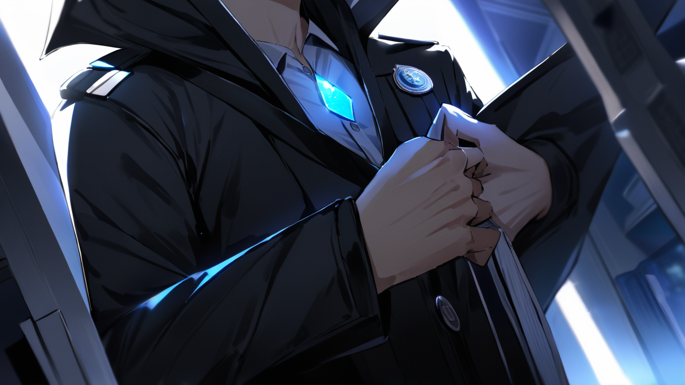

# 6화: 기억의 빛

## Scene 2: 진실의 순간

통제국 요원이 천천히 제복의 단추를 풀기 시작한다.  
마지막 남은 자존심을 내려놓는 듯한 무거운 동작이다.  
그의 가슴에 달린 기억 통제국 뱃지가 특별 교육실의 푸른 빛을 반사하며 마지막으로 한번 빛난다.  
그리고 조용히, 마치 오래된 시대의 막이 내리듯 바닥으로 떨어진다.

[신분 변경 감지]  
대상: 통제국 요원  
현재 상태: 지위/권한 자발적 포기  
정신 상태: 안정적 변환 중  
특이사항: 기억 통제 시스템 거부  
주목: 자발적 체제 전환 시작

"이제... 이 실험은 끝났습니다."  
그의 목소리는 공식적이면서도 어딘가 안도감이 묻어난다. 

"서하린 씨, 당신의 능력은 우리가 찾던 해답이었군요.  
아니... 어쩌면 우리가 잘못된 질문을 하고 있었는지도 모르겠습니다."

그가 잠시 말을 멈추고 깊은 숨을 내쉰다.  
20년이라는 시간 동안 쌓아온 모든 신념이 무너지는 순간이다.

"기억은 지워지거나 조작되어서는 안 되는 것...  
그저 치유되고 회복되어야 하는 것...  
그 단순한 진실을 우리는 왜 그렇게 오랫동안 보지 못했을까요?"

[시스템 대전환 감지]  
이전: 기억 통제/억압 체계  
현재: 자연 치유 시스템으로 변환 중  
진행률: 67% (안정적)  
예상 소요 시간: 48시간  
특이사항: 자발적/자연적 전환  
비고: 전례 없는 패러다임 시프트

하나둘씩 기억 거래소의 불이 다시 켜지기 시작한다.  
이제 더 이상 위험을 경고하는 붉은 등은 없다.  
대신 따스한 백색광이 공간을 채운다.  
마치 새로운 시대의 여명처럼 부드럽고 밝은 빛이다.

"앞으로 기억 거래소는..."  
세아가 감격에 찬 목소리로 말한다.  
그녀의 왼쪽 관자놀이의 흉터가 이제는 마치 훈장처럼 빛난다. 

"진정한 의미의 치유 공간이 될 거예요.  
더 이상의 통제나 억압이 아닌...  
상처받은 기억들이 회복되는 곳으로."

[기관 정체성 변경]  
명칭: 기억 거래소 → 기억 치유 센터  
목적: 통제/관리 → 치유/회복  
운영 방식: 강제적 → 자발적  
핵심 가치: 억압 → 이해  
시행일: 즉시

'기억 치유 센터...'

마음속으로 새 이름을 되뇌어본다.  
단순한 이름 변경이 아니라, 완전히 새로운 시작을 의미하는 말이다.  
내 심장이 따뜻하게 뛴다.

지현이 천천히 일어선다.  
그녀의 모든 기억이 온전히 돌아왔다.  
6개월간의 공백, 지하 실험실에서 목격했던 끔찍한 장면들, 도망치던 순간의 공포까지.  
하지만 이제 그 기억들은 더 이상 그녀를 괴롭히지 않는다.  
오히려 그녀를 더 강하게 만드는 진실이 되어있다.

"이제 기억났어요."  
지현이 미소짓는다.  
그녀의 눈에서 흐르는 것은 더 이상 푸른 기억의 파편이 아닌, 진정한 안도의 눈물이다. 

"그날의 진실을... 그리고 그 진실을 지키려 했던 선배님의 마음도..."

[임지현 상태]  
기억 회복: 완료 (100%)  
트라우마 치유도: 92%  
정신 안정도: 95/100  
현재 감정: 안도/이해/용서  
특이사항: 기억의 재해석 진행 중

"하린 씨." 

민준의 조심스러운 목소리가 울린다.  
그가 천천히 내게 다가온다.  
평소의 차가운 전문가적 태도는 온데간데없고,  
그저 한 사람의 마음을 전하고 싶어 하는 청년의 모습만이 남아있다.

"저와... 잠시 이야기 나누시겠습니까?"

고개를 끄덕인다.  
둘은 특별 교육실을 나와 옥상으로 향한다.  
새벽공기가 차갑게 얼굴을 스친다.  
아직 어둠이 채 가시지 않은 하늘에, 희미한 여명이 스며들기 시작하고 있다.

[외부 환경]  
시간: 05:27 AM  
기온: 16.5℃  
습도: 82%  
하늘: 동쪽 하늘 여명 시작  
도시: 깨어나는 중  
분위기: 새로운 시작의 아침

"그날... 정말 죄송합니다."  
민준의 목소리가 떨린다.  
오랫동안 가슴 깊이 묻어두었던 진심이 흘러나온다. 

"당신을 기억하고 싶지 않다고 했던 건... 모두 거짓말이었어요.  
통제국이 당신을 노리고 있다는 걸 알게 됐고...  
당신의 특별한 능력이 위험에 처할 수 있다는 걸 깨달았죠.  
그래서... 당신을 지키기 위해서..."

그의 말이 흐려진다.  
1년 전의 기억이 선명하게 떠오른다.  
병원 앞, 차가운 겨울 아침.  
그가 내뱉었던 잔인한 거짓말.  
그리고 내 눈에서 흘러내리던 눈물방울들.

[강민준 감정 상태]  
현재: 깊은 후회/자책/그리움  
기억 선명도: 매우 높음  
정신적 부담: 감소 중  
하린에 대한 감정: 순수한 보호 본능  
특이사항: 자발적 진실 고백

"알아요."  
부드럽게 말한다.  
내 목소리에는 더 이상 원망이 없다. 

"이제 모든 게 기억나요.  
그날 병원에서...  
선배님의 눈빛에서 진심을 읽었어요.  
지우고 싶지 않은데...  
지워야만 했던 그 마음을..."

'그때 알았어야 했는데...'

새벽바람이 둘 사이로 불어온다.  
내 머리카락이 나풀거린다.  
민준은 무의식적으로 손을 뻗어 내 머리카락을 정리해주려 하지만, 중간에 멈춘다. 
아직은... 그럴 자격이 없다고 생각하는 걸까.

[감정 교감 현상]  
대상 1: 서하린  
대상 2: 강민준  
상태: 깊은 이해의 순간  
진행: 자연스러운 감정 회복  
특이점: 무의식적 교감  
신뢰도: 급상승 중

"이제..."  
민준이 조심스럽게 내 손을 잡는다.  
그의 손이 미세하게 떨리고 있다. 

"다시 시작할 수 있을까요?  
이번에는... 진실된 기억들과 함께...  
그리고 더 이상의 거짓말 없이..."

대답 대신 따뜻한 미소를 짓는다.  
둘의 주변으로 기억들이 반짝이며 춤추기 시작한다.  
우리의 과거, 현재, 그리고 미래가 될 순간들이 부드럽게 어우러진다.  
마치 오랫동안 흩어져 있던 조각들이 마침내 하나의 그림을 완성하는 것처럼.

[기억 공명 현상]  
유형: 감정적 교감/치유  
강도: 매우 강함 (89%)  
영향 범위: 국소적 (2인)  
특성: 자연스러운 기억 회복  
진행: 과거-현재-미래의 조화로운 통합  
예상: 완전한 관계 회복 가능

'이게 내 능력의 진정한 의미였구나...'

1년간의 상처, 오해, 그리고 그리움이 마침내 치유되기 시작한다.  
기억들이 우리 주변에서 부드럽게 춤을 추며 서로를 엮어간다.  
이것이 진정한 기억의 힘이다.  
지우는 것이 아닌, 치유하는 것. 부정하는 것이 아닌, 받아들이는 것.

멀리서 도시가 깨어나기 시작한다.  
빌딩 숲 사이로 첫 번째 햇살이 스며든다.  
기억 거래소의 푸른 네온사인이 하나둘 꺼지고, 대신 따스한 아침 햇살이 건물을 비추기 시작한다.  
새로운 시작을 알리는 여명이다.

"자, 이제 진짜 시작이에요."  
말한다.  
내 목소리에는 확신과 희망이 가득하다. 

"우리 모두의... 진정한 치유가..."

[새로운 시작]  
시스템: 기억 치유 센터  
목적: 자연 회복/치유/통합  
방식: 공감과 이해, 자발적 참여  
특징: 치유의 빛을 통한 회복  
운영: 하린의 능력을 중심으로 한 새로운 패러다임  
비고: 인류 기억 관리의 새로운 장 시작

기억 거래소...  
아니, 이제는 기억 치유 센터가 될 이곳에서, 새로운 이야기가 시작되려 하고 있다.  
더 이상 억압되거나 지워지지 않을 진실들의 이야기.  
그리고 그 중심에는, 기억을 치유하는 특별한 능력을 가진 내가 있다.

동이 트는 하늘을 배경으로, 민준과 내 실루엣이 겹쳐진다.  
새로운 시작을 알리는 아침이, 우리의 새로운 이야기를 조용히 지켜보고 있다.

'이제 시작이야... 진짜 내 이야기가...'

[다음 화에 계속...]

