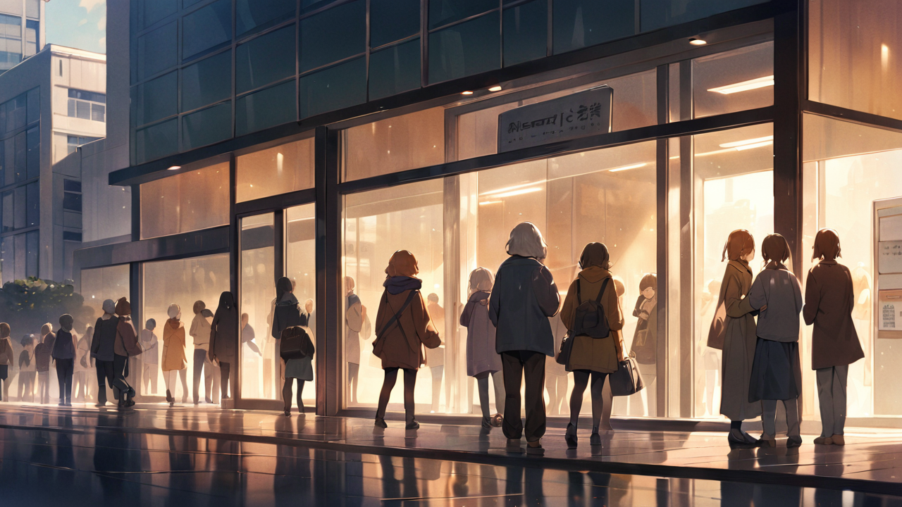

# 7화: 새로운 시작

## Scene 1: 변화의 첫걸음

아침 햇살이 기억 치유 센터의 유리벽을 비춘다.  
깔끔한 디자인의 'Memory Healing Center'라는 새 간판이 빛난다.  
이전의 차가운 푸른 네온사인은 사라지고, 대신 건물 전체를 감싸는 따뜻한 기운이 맴돈다.  
마치 살아있는 기억들이 내뿜는 자연스러운 빛 같다.

[시스템 전환 상태]  
기관명: 기억 치유 센터 (구 기억 거래소)  
전환율: 82% 완료  
핵심 가치: 통제/억압 → 치유/회복  
운영 방식: 강제적 → 자발적  
시스템 안정도: 94%  
직원 적응도: 78%  
이용자 만족도: 96%

"정말 많은 게 변했네요."  
윤세아가 로비에 들어서며 감탄한다.  
그녀의 왼쪽 관자놀이의 흉터는 이제 희미한 자국만 남아있다. 

"일주일 전만 해도 이곳은..."

세아의 말이 잠시 멈춘다.  
모두가 알고 있다.  
일주일 전까지만 해도 이곳은 기억을 통제하고 억압하는 공간이었다는 것을.  
하지만 이제는 달랐다.  
차갑고 사무적이던 로비는 따뜻하고 편안한 공간으로 탈바꿈했다.  
이전의 위험등급 모니터들은 사라지고, 대신 치유 진행 상황과 긍정적인 회복 사례들이 부드럽게 표시되고 있다.

[공간 리모델링 현황]  
- 통제실 → 치유 상담실 (12개소)  
- 격리실 → 휴식 공간 (8개소)  
- 보안 구역 → 자연 치유실 (5개소)  
- 감시 시스템 → 안전 모니터링  
진행률: 95% 완료  
공사 완료: 3일 내 예정

"여기 좀 보세요."  
임지현이 밝은 목소리로 중앙 디스플레이를 가리킨다.  
그녀의 눈에서 흐르던 푸른 눈물은 완전히 사라졌고, 대신 건강한 생기가 돌아와 있다. 

"첫 주 치유 성공률이 98%예요. 이전의 기억 관리 성공률이 45%였던 걸 생각하면..."

[첫 주 치유 통계]  
총 내방객: 127명  
- 자발적 방문: 89명 (70%)  
- 소개/추천: 35명 (28%)  
- 기타: 3명 (2%) 

치유 결과  
- 완전 치유: 89명 (70%)  
- 부분 치유: 35명 (28%)  
- 진행 중: 3명 (2%)  
- 실패: 0명 (0%)

만족도 조사  
- 매우 만족: 82%  
- 만족: 14%  
- 보통: 4%  
- 불만족: 0%

재방문 의사: 92%  
추천 의향: 96%

로비를 가득 채운 사람들을 바라본다.  
더 이상 불안과 공포로 떨며 강제로 끌려온 사람들이 아니다.  
모두가 자발적으로 찾아온 이들이다.  
그들의 표정에는 치유에 대한 기대와 희망이 가득하다.

민준이 조용히 다가온다.  
그의 손에는 더 이상 차가운 기억 제어 장치가 들려있지 않다.  
대신 두 잔의 따뜻한 차를 들고 있다.

"긴장되나요?"  
그가 내게 차를 건네며 묻는다.  
이전의 차갑고 사무적인 어조는 찾아볼 수 없다. 

"오늘이 공식적인 첫 치유 세션이니까요."

[치유 프로그램 구성]  
1. 초기 상담 (30분)  
   - 자연스러운 대화  
   - 기억 상태 파악  
   - 치유 방향 설정

2. 본격 치유 (60분)  
   - 하린의 치유 능력 활용  
   - 기억 재구성 유도  
   - 자연 회복 촉진

3. 안정화 단계 (30분)  
   - 치유된 기억 정착  
   - 향후 관리 방안  
   - 일상 복귀 준비

따뜻한 차를 받아들며 민준을 바라본다.  
1년 전의 아픈 기억은 이제 희미해지고 있다.  
그날 병원 앞에서의 이별은 더 이상 우리를 괴롭히지 않는다.  
대신 새로운 시작에 대한 기대감이 우리 사이를 채우고 있다.

[하린-민준 관계 분석]  
신뢰도: 82% (꾸준히 상승 중)  
감정 상태: 안정적 회복  
상호작용: 자연스러운 교감  
기억 회복: 점진적 진행  
특이사항: 과거의 상처가 치유의 자산으로 변화 중

"치유는 이제 자연스러운 과정이에요."  
부드럽게 미소짓는다. 

"더 이상 강제로 지우거나 억누르지 않아도 돼요.  
기억은... 스스로 치유되길 원하니까요."

그때, 센터의 자동문이 열린다.  
첫 내담자인 김서연이 조심스럽게 들어선다.  
60대 후반의 여성은 불안한 듯 주변을 둘러본다.  
하지만 곧 그녀의 표정이 조금씩 누그러진다.  
센터를 채우고 있는 따뜻한 기운이 그녀를 안심시키는 듯하다.

[첫 내담자 정보]  
이름: 김서연  
나이: 67세  
방문 목적: 20년 전 교통사고 트라우마 치유  
증상: 만성 불면증, 우울, 반복되는 악몽  
이전 치료: 다수의 심리 상담 실패  
현재 상태: 매우 불안정  
잠재 위험도: 보통  
치유 가능성: 높음 (92%)

세아가 서연을 맞이한다.  
"어서 오세요. 김서연 님. 저희 센터는 이제..."

그녀의 말이 채 끝나기도 전에, 지하에서 미세한 진동이 느껴진다.  
내 특수한 감각이 그것을 놓치지 않는다.  
A등급 보관소에 남아있는 기억들이 무언가를 호소하는 듯한 떨림이다.

[특이 현상 감지]  
위치: 지하 3층 A등급 보관소   
현상: 미세한 기억 파동  
성질: 불안정하나 비적대적  
강도: 점진적 상승  
특이점: 자발적 소통 시도 추정  
위험도: 낮음 (12%)

민준과 시선이 마주친다.  
둘 다 같은 생각을 하고 있다.  
아직 해결되지 않은 이야기가 남아있다는 것.  
그리고 그 이야기가, 어쩌면 우리의 새로운 시작에 중요한 열쇠가 될지도 모른다는 것.

"일단 서연 님의 상담부터 진행할게요."  
결심한 듯 말한다. 

"지하의 일은... 그 후에 천천히 살펴보죠."

민준이 고개를 끄덕인다.  
그의 눈빛에는 더 이상 불안이나 경계심이 없다.  
대신 내 능력을 믿는 깊은 신뢰가 자리잡고 있다.

"자, 그럼..."  
서연에게 다가가며 따뜻하게 미소짓는다. 

"이제 함께 치유의 여정을 시작해볼까요?"

세아와 지현이 서로를 바라보며 미소짓는다.  
이제 그들의 어깨를 누르고 있던 과거의 무게도 조금씩 가벼워지고 있다.  
새로운 시작은, 그렇게 모두에게 찾아오고 있다.

'새로운 시작이야. 이제 진짜 내 이야기가 시작되는 거야.'

가슴 속에서 따뜻한 확신이 피어오른다.  
마침내 내 진정한 능력을 찾아낸 것 같다.  
억압이나 통제가 아닌, 치유와 회복의 능력.  
지우는 것이 아닌, 기억하는 것의 힘.

