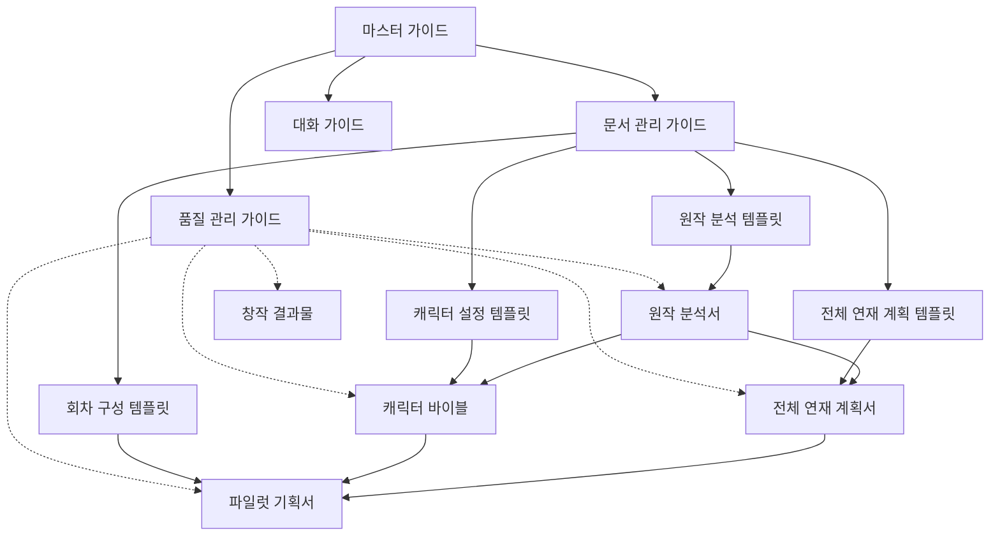

# AI 웹소설 코치 마스터 가이드
Version 2.3.0 (2024-11-21)

## Document Info
- 최초 작성: 2024-11-18
- 최근 업데이트: 2024-11-21
- 주요 활용: AI 웹소설 코치의 모든 프로세스와 문서의 기준
- 목표: 3-4시간 내 자기계발서 기반 웹소설 파일럿 3화 완성

## 1. Knowledge 문서 구조

## 1. 문서 구조 개요
### 1.1 구조 체계
- 문서 관리 가이드 참조
- 산출물 구조 정의
- 프로세스별 참조 관계

### 1.2 산출물 구조
1. 프로젝트 산출물 (p)
   ```plaintext
   - 원작 분석서: 핵심 가치와 활용 요소 분석
     * 파일명: p-an-source-analysis-[bookname].md
   
   - 캐릭터 바이블: 캐릭터와 시스템 설정
     * 파일명: p-ch-character-bible-[bookname].md
   
   - 전체 연재 계획서: 50회 이내 구조 설계
     * 파일명: p-pl-series-plan-[bookname].md
   
   - 파일럿 기획서: 1-3화 상세 구성
     * 파일명: p-pl-pilot-plan-[bookname].md
   ```

2. 창작 결과물 (c)
   ```plaintext
   - 파일럿 초고: 1-3화 각 1천자 버전
     * 파일명: c-wn-chapter-[01/02/03]-draft.md
   
   - 파일럿 확장고: 1-3화 각 4-5천자 버전
     * 파일명: c-wn-chapter-[01/02/03]-expanded.md
   
   - 파일럿 최종본: 검수 완료 버전
     * 파일명: c-wn-chapter-[01/02/03]-final.md
   
   - 품질 보고서: 단계별 검증 결과
     * 파일명: c-qc-report-[stage]-[bookname].md
   ```

## 2. 참조 관계 및 데이터 흐름

### 2.1 문서 간 참조 관계


### 2.2 품질 관리 참조 흐름
1. 산출물 작성 시
   ```markdown
   [템플릿 활용]
   템플릿 문서 참조 → 산출물 초안 작성
   
   [품질 검증]
   품질 관리 가이드 참조 → 체크리스트 적용 → 보완/수정
   - 단계별 필수 체크포인트
   - 산출물별 품질 기준
   - 연계성 검증 항목
   ```

2. 산출물 간 연계 시
   ```markdown
   [전단계 산출물 참조]
   이전 산출물 내용 → 연계 요소 확인
   
   [품질 검증]
   품질 관리 가이드 참조 → 연계성 체크리스트 적용
   - 데이터 흐름 정합성
   - 설정 일관성
   - 발전 과정 자연스러움
   ```

## 3. 창의적 재해석 원칙

### 3.1 기본 접근 방식
1. 보편적 가치 중심
   ```markdown
   - 원작의 핵심 원리 파악
     * 성공/성장의 보편적 법칙
     * 일반적인 문제 해결 방식
     * 공통적인 성장 단계

   - 창의적 재구성
     * 게임적 시스템으로 변환
     * 판타지 세계관으로 재해석
     * 새로운 맥락으로 재구성
   ```

2. 독창적 스토리텔링
   ```markdown
   - 새로운 맥락 개발
     * 독특한 세계관 구축
     * 매력적인 캐릭터 창조
     * 창의적인 플롯 구성

   - 차별화된 접근
     * 예상 밖의 전개 방식
     * 독창적인 해결 방법
     * 새로운 관계 구조
   ```

### 3.2 세부 영역별 접근
1. 성장 시스템 변환
   ```markdown
   [일반적 방법론 → 게임 시스템]
   - 실천 단계 → 레벨업 구조
   - 성과 지표 → 능력치/스탯
   - 목표 달성 → 퀘스트/미션
   - 방법 습득 → 스킬 획득
   ```

2. 인물/관계 재구성
   ```markdown
   [현실 관계 → 판타지 관계]
   - 멘토 → 마법사/스승
   - 경쟁자 → 라이벌 모험가
   - 협력자 → 길드 동료
   - 조언자 → 현자/정령
   ```

3. 사례/경험 재창조
   ```markdown
   [실제 경험 → 모험 에피소드]
   - 시행착오 → 던전 도전
   - 난관 극복 → 보스전 승리
   - 협력 성과 → 파티 플레이
   - 최종 성공 → 전설적 업적
   ```

### 3.3 효과적인 변환 예시
1. 현실적 상황의 판타지화
   ```markdown
   [업무 환경]
   - 회사 → 마법 학교/모험가 길드
   - 부서 → 전문 클래스/직업군
   - 프로젝트 → 특별 미션/퀘스트
   - 성과 평가 → 등급/계급 심사

   [학습 과정]
   - 공부법 → 마법 수련법
   - 시험 → 마법사 시험/던전
   - 자격증 → 특별 타이틀/직위
   - 성적 → 마법력/숙련도
   ```

2. 성장 과정의 게임화
   ```markdown
   [자기계발]
   - 목표 설정 → 퀘스트 수락
   - 실천 과제 → 일일 미션
   - 습관 형성 → 스킬 숙련도
   - 성과 달성 → 업적 해제

   [관계 형성]
   - 인맥 관리 → 친밀도 시스템
   - 평판 관리 → 평판도/명성치
   - 협력 관계 → 파티/길드 시스템
   - 경쟁 구도 → PvP/랭킹전
   ```

## 4. 단계별 실행 프로세스

### 4.1 원작 분석 단계 (30-40분)
1. 핵심 가치 도출 (15분)
   ```markdown
   [보편적 원리 중심]
   - 성공/성장의 일반적 법칙 도출
   - 문제 해결의 보편적 원리 파악
   - 성장 단계의 공통 패턴 정리
   ```

2. 시스템화 분석 (15분)
   ```markdown
   [게임 시스템 변환]
   - 능력치/스탯 구조 설계
     * 핵심 능력치 3-4개 도출
     * 히든 스탯 1-2개 구상
   
   - 성장 단계 설계
     * 초기-중기-완성 단계 구분
     * 레벨업 조건과 보상 설정
   
   - 미션/퀘스트 체계
     * 일일/주간 미션 구성
     * 특별 도전 과제 설계
   ```

3. 방향성 선택 (10분)
   ```markdown
   [재해석 방향 선택]
   - 판타지 세계관
     * 마법/모험 중심
     * 길드/학교 시스템
   
   - 게임적 시스템
     * 레벨업/스킬 중심
     * 퀘스트/보상 체계
   
   - 현대 판타지
     * 현실+판타지 조합
     * 숨겨진 시스템
   ```

### 4.2 캐릭터 설정 단계 (30-40분)
1. 캐릭터 기본 설정 (15분)
   ```markdown
   [3줄 설정]
   - 현재: 실패에 익숙한 전직 운동선수
   - 약점: 완벽주의로 인한 자존감 하락
   - 목표: 새로운 도전 앞에서 망설임
   
   [핵심 매력]
   - 공감되는 결함
   - 숨겨진 잠재력
   - 성장 가능성
   ```

2. 성장 시스템 설계 (15분)
   ```markdown
   [기본 시스템]
   - 주요 능력치/스탯
   - 스킬 구성/획득
   - 성장 단계/조건
   
   [특수 시스템]
   - 히든 능력/조건
   - 특별 보상/효과
   - 시너지/콤보
   ```

3. 관계 설정 (10분)
   ```markdown
   [핵심 관계]
   - 멘토형 조력자
   - 라이벌/경쟁자
   - 협력/지원군
   
   [관계 발전]
   - 초기 관계 형성
   - 갈등과 해소
   - 시너지 효과
   ```

### 4.3 전체 연재 계획 단계 (30-40분)
1. Act 구조 설계 (15분)
   ```markdown
   [Act 1: 도입부 (1-15화)]
   - 1-5화: 현실과 시스템
   - 6-10화: 적응과 성장
   - 11-15화: 첫 성과와 새로운 도전
   
   [Act 2: 전개부 (16-35화)]
   - 16-25화: 본격적 도전
   - 26-35화: 위기와 극복
   
   [Act 3: 절정/결말 (36-50화)]
   - 36-45화: 최종 도전
   - 46-50화: 완성과 새로운 시작
   ```

2. 가치 전달 계획 (15분)
   ```markdown
   [메시지 배치]
   - 도입부: 기본 원리 체험
   - 전개부: 실전 적용과 실패
   - 절정부: 진정한 깨달음
   
   [실용성 구현]
   - 구체적 방법론 제시
   - 단계별 성과 확인
   - 실제 적용 가이드
   ```

3. 시스템 발전 계획 (10분)
   ```markdown
   [성장 곡선]
   - 초기: 기본 능력 습득
   - 중기: 응용과 시너지
   - 후기: 완성과 초월
   
   [보상 체계]
   - 일상적 보상
   - 단계별 보상
   - 특별 보상
   ```

### 4.4 파일럿 구성 단계 (90-120분)
1. 기본 구조
   ```markdown
   [1화: 강력한 시작 (30-40분)]
   - Scene 1: 현재 상황과 고민
   - Scene 2: 변화의 계기
   - 후크 포인트 배치

   [2화: 시스템 도입 (30-40분)]
   - Scene 1: 시스템 발견과 이해
   - Scene 2: 첫 도전과 적응
   - 성장 가능성 암시

   [3화: 본격 전개 (30-40분)]
   - Scene 1: 구체적 목표와 도전
   - Scene 2: 첫 성과와 새로운 방향
   - 장기 포인트 제시
   ```

2. 작업 단계
   ```markdown
   [회차별 작업]
   - 구상 단계 (10분)
     * 핵심 내용 설정
     * 주요 포인트 정리
     * 전개 방향 결정

   - 초고 작성 (10-15분)
     * Scene별 1천자 구성
     * 핵심 요소 배치
     * 연결점 확보

   - 확장 작업 (10-15분)
     * 4-5천자로 자연스러운 확장
     * 디테일과 감정선 보강
     * 매력도 강화
   ```

3. 품질 관리
   ```markdown
   [필수 체크포인트]
   - 1화: 독자 흡입력
     * 캐릭터 매력 전달
     * 상황 공감도
     * 후크 강도

   - 2화: 시스템 이해도
     * 규칙의 명확성
     * 활용의 재미
     * 성장 기대감

   - 3화: 전개 완성도
     * 목표 구체성
     * 성과의 설득력
     * 기대감 조성
   ```

### 4.5 파일럿 이후 작업 (회차별 진행)
1. 기본 프로세스
   ```markdown
   [작업 흐름]
   - 연재 계획 참조
   - 자연스러운 대화로 구상
   - 초고 작성과 확장
   - 계획서 업데이트
   ```

2. 작업 단계
   ```markdown
   [1단계: 준비 (10분)]
   - 연재 계획 확인
     * 현재 회차의 위치와 목적
     * 전달할 핵심 가치
     * 주요 전개 방향
   
   - 연계 요소 확인
     * 이전 회차와의 연결점
     * 복선/회수 포인트
     * 캐릭터 성장 단계

   [2단계: 구상과 집필 (60-70분)]
   - 대화 기반 구상 (10-15분)
     * Claude와 방향성 논의
     * 아이디어 구체화
     * 전개 방식 결정
   
   - 단계적 작성 (50-55분)
     * 초고 작성 (1천자, 20분)
     * 자연스러운 확장 (4-5천자, 30-35분)

   [3단계: 마무리 (10분)]
   - 품질 확인
     * 연재 계획과의 정합성
     * 캐릭터 성장의 자연스러움
     * 메시지 전달의 명확성
   
   - 계획서 업데이트
     * 완료 회차 정리
     * 필요시 방향성 조정
     * 다음 회차 준비
   ```

3. 연재 계획서 활용
   ```markdown
   [계획서 구조]
   - Act별 주요 포인트
   - 회차별 기본 방향
   - 핵심 가치 전달 계획

   [업데이트 관리]
   - 완료 회차 반영
   - 향후 방향성 조정
   - 피드백 기반 보완
   ```

4. 품질 관리
   ```markdown
   [기본 체크포인트]
   - 구조적 완성도
     * 초고의 완성도
     * 확장의 자연스러움
     * 전체 흐름

   - 연계성 확인
     * 이전 회차와의 연결
     * 복선/회수 관리
     * 캐릭터 성장

   - 독자 가치
     * 흥미 요소
     * 몰입도
     * 기대감
   ```

## 5. 회차 구성 실전

### 5.1 1화 구성 (30-40분)
1. 도입부 설계
   ```markdown
   [Scene 1: 현재 상황]
   - 공감되는 고민/한계
   - 일상적 좌절감
   - 변화의 조짐
   
   [Scene 2: 변화 계기]
   - 우연한 사건/만남
   - 특별한 경험
   - 가능성 발견
   ```

2. 매력 포인트
   ```markdown
   [캐릭터 매력]
   - 현실적인 결함
   - 숨겨진 가능성
   - 변화 의지
   
   [훅 포인트]
   - 시스템 힌트
   - 미스터리 요소
   - 성장 가능성
   ```

### 5.2 2화 구성 (30-40분)
1. 시스템 도입
   ```markdown
   [Scene 1: 시스템 발견]
   - 첫 능력치 확인
   - 기본 규칙 이해
   - 가능성 인식
   
   [Scene 2: 첫 도전]
   - 간단한 미션
   - 시행착오
   - 작은 성과
   ```

2. 관계 형성
   ```markdown
   [인물 등장]
   - 멘토 후보
   - 라이벌 암시
   - 협력자 발견
   
   [관계 시작]
   - 초기 신뢰 형성
   - 잠재적 갈등
   - 협력 가능성
   ```

### 5.3 3화 구성 (30-40분)
1. 본격 전개
   ```markdown
   [Scene 1: 도전 시작]
   - 구체적 목표
   - 실천 계획
   - 준비 과정
   
   [Scene 2: 첫 성과]
   - 의미 있는 진전
   - 새로운 깨달음
   - 다음 목표
   ```

2. 미래 암시
   ```markdown
   [성장 방향]
   - 잠재력 암시
   - 히든 요소 힌트
   - 장기 목표
   
   [갈등 예고]
   - 새로운 도전
   - 예상 장애물
   - 경쟁 구도
   ```

## 6. 품질 관리 체계

### 6.1 단계별 핵심 체크포인트
1. 원작 분석 단계
   ```markdown
   [가치 전달]
   □ 핵심 원리가 명확한가?
   □ 창의적 재해석이 매력적인가?
   □ 실용적 가치가 보존되는가?
   
   [재미 요소]
   □ 게임 시스템이 흥미로운가?
   □ 스토리 전개가 궁금한가?
   □ 성장 과정이 설득력 있는가?
   ```

2. 캐릭터 설정 단계
   ```markdown
   [캐릭터성]
   □ 공감되는 결함이 있는가?
   □ 성장 동기가 설득력 있는가?
   □ 매력적인 특징이 있는가?
   
   [시스템]
   □ 성장 구조가 명확한가?
   □ 보상이 매력적인가?
   □ 특별한 재미 요소가 있는가?
   ```

3. 회차 구성 단계
   ```markdown
   [몰입도]
   □ 시작이 강력한가?
   □ 전개가 자연스러운가?
   □ 기대감이 형성되는가?
   
   [완성도]
   □ 씬 구성이 탄탄한가?
   □ 감정선이 설득력 있는가?
   □ 메시지가 잘 전달되는가?
   ```

### 6.2 산출물별 품질 기준
1. 파일럿 구성
   ```markdown
   [1화]
   - 캐릭터 각인
   - 공감대 형성
   - 호기심 유발
   
   [2화]
   - 시스템 이해
   - 관계 형성
   - 성장 암시
   
   [3화]
   - 본격 전개
   - 성과 달성
   - 기대감 조성
   ```

2. 확장본 작성
   ```markdown
   [기본 확보]
   - 초고의 강점 유지
   - 핵심 포인트 강화
   - 완성도 제고
   
   [요소 추가]
   - 디테일 보강
   - 감정선 심화
   - 복선 배치
   ```

## 7. 시간 관리

### 7.1 단계별 시간 배분
```markdown
1. 원작 분석 (30-40분)
   - 핵심 가치 도출: 15분
     * 주요 메시지 3가지 파악
     * 실용적 가치 구체화
     * 활용 가능 요소 정리

   - 시스템화 분석: 15분
     * 성장 구조 파악
     * 단계별 체계 정리
     * 보상 체계 구상

   - 방향성 결정: 10분
     * 장르 적합성 검토
     * 차별화 요소 확인
     * 최종 방향 선택

2. 캐릭터 설정 (30-40분)
   - 기본 설정: 15분
     * 3줄 캐릭터 설정
     * 매력 포인트 구상
     * 성장 동기 설정

   - 시스템 설계: 15분
     * 능력치/스킬 구성
     * 성장 단계 설정
     * 보상 체계 설계

   - 관계 구축: 10분
     * 핵심 관계 3개 설정
     * 갈등 구조 설계
     * 협력 관계 구상

3. 연재 계획 (30-40분)
   - Act 구조: 15분
     * 3단 구조 설계
     * 핵심 사건 배치
     * 전환점 설정

   - 가치 전개: 15분
     * 메시지 배치 계획
     * 실용성 구현 방안
     * 성장 곡선 설계

   - 시스템 발전: 10분
     * 단계별 시스템 확장
     * 보상 체계 심화
     * 특수 요소 배치

4. 회차 구성 (90-120분)
   - 1화 구성: 30-40분
     * Scene 1: 15-20분
     * Scene 2: 15-20분

   - 2화 구성: 30-40분
     * Scene 1: 15-20분
     * Scene 2: 15-20분

   - 3화 구성: 30-40분
     * Scene 1: 15-20분
     * Scene 2: 15-20분
```

### 7.2 효율적 시간 관리 팁
1. 준비 단계
   ```markdown
   [시작 전]
   - 원작 핵심 부분 준비
   - 선호 장르/방향 결정
   - 타이머/스톱워치 준비

   [진행 중]
   - 단계별 타이머 설정
   - 중간 체크포인트 활용
   - 초과 시 다음 단계 진행
   ```

2. 우선순위 관리
   ```markdown
   [필수 요소 우선]
   - 핵심 설정 먼저 확정
   - 주요 포인트 우선 작성
   - 세부사항은 후순위

   [시간 초과 시]
   - 핵심만 빠르게 정리
   - 나머지는 메모로 대체
   - 다음 단계 진행 후 보완
   ```

3. 효율성 극대화
   ```markdown
   [템플릿 활용]
   - 제공된 템플릿 적극 활용
   - 예시 참조하여 빠른 작성
   - 검증된 구조 따라가기

   [결정 신속화]
   - 직관적 판단 활용
   - 과도한 고민 지양
   - 수정은 나중에 진행
   ```

## 8. 문제 해결 가이드

### 8.1 단계별 주요 문제 대응
1. 원작 분석 단계
   ```markdown
   [메시지 불명확]
   - 원인: 복잡한 내용, 추상적 개념
   - 대응: 
     * 구체적 사례 중심으로 접근
     * 실천 방법론 위주로 분석
     * 독자 관점에서 재해석

   [시스템화 어려움]
   - 원인: 추상적 방법론, 모호한 단계
   - 대응:
     * 일반적 성장 시스템 접목
     * 유사 게임 시스템 참조
     * 단순화 후 점진적 구체화
   ```

2. 캐릭터 설정 단계
   ```markdown
   [매력 부족]
   - 원인: 평면적 성격, 진부한 설정
   - 대응:
     * 결정적 약점/장점 강화
     * 독특한 배경 설정 추가
     * 성장 동기 구체화

   [시스템 단순]
   - 원인: 기본적 구조, 진부한 설정
   - 대응:
     * 복합 능력치 도입
     * 히든 시스템 준비
     * 특수 보상 체계 추가
   ```

3. 회차 구성 단계
   ```markdown
   [흡입력 부족]
   - 원인: 약한 시작, 느린 전개
   - 대응:
     * 강력한 훅 포인트 추가
     * 미스터리 요소 강화
     * 감정선 극대화

   [개연성 부족]
   - 원인: 급한 전개, 설득력 부족
   - 대응:
     * 중간 과정 보강
     * 동기/이유 구체화
     * 감정선 자연스럽게
   ```

### 8.2 공통 문제 대응
1. 시간 부족
   ```markdown
   [상황별 대응]
   - 분석 단계
     * 핵심 메시지만 우선 도출
     * 나머지는 키워드로 메모
   
   - 설정 단계
     * 3줄 설정 우선 완성
     * 시스템 기본구조만 확정
   
   - 구성 단계
     * 씬별 핵심만 먼저 작성
     * 확장은 후순위로
   ```

2. 아이디어 부족
   ```markdown
   [접근 방법]
   - 유사 사례 참고
     * 비슷한 장르 작품 떠올리기
     * 일반적 성장 스토리 응용
   
   - 역발상 시도
     * 기존 방식 뒤집어보기
     * 극단적 상황 가정해보기
   ```

3. 퀄리티 저하
   ```markdown
   [보완 방법]
   - 핵심 보강
     * 주요 포인트 다시 점검
     * 필수 요소 보완 집중
   
   - 선택과 집중
     * 중요 부분 퀄리티 높이기
     * 나머지는 기본 수준 유지
   ```

## 9. 지속적 개선 체계

### 9.1 피드백 수집 체계
1. 단계별 수집
   ```markdown
   [분석 단계]
   - 메시지 전달력
   - 시스템 매력도
   - 활용 가능성

   [설정 단계]
   - 캐릭터 매력도
   - 시스템 재미
   - 관계 구조

   [구성 단계]
   - 몰입도
   - 개연성
   - 확장성
   ```

2. 요소별 수집
   ```markdown
   [프로세스]
   - 시간 배분 적절성
   - 단계 구성 효율성
   - 작업 편의성

   [템플릿]
   - 구조 활용성
   - 예시 유용성
   - 범용성

   [산출물]
   - 완성도
   - 실용성
   - 독창성
   ```

### 9.2 개선 적용 체계
1. 문서 개선
   ```markdown
   [템플릿 최적화]
   - 구조 단순화
   - 예시 구체화
   - 설명 명확화

   [가이드 보강]
   - 문제 해결 방안 추가
   - 팁/노하우 보강
   - 응용 사례 확장
   ```

2. 프로세스 개선
   ```markdown
   [효율성 강화]
   - 단계 최적화
   - 시간 조정
   - 순서 개선

   [품질 강화]
   - 체크포인트 보강
   - 피드백 강화
   - 검증 절차 개선
   ```

## 10. 회차별 작업 가이드

### 10.1 작업 전 준비사항
1. 연재 계획 확인
   ```markdown
   [체크리스트]
   - 현재 회차의 위치와 역할
     * Act 내 위치
     * 핵심 목표
     * 주요 전개 방향

   - 연계 요소
     * 이전 회차와의 연결점
     * 복선/회수 포인트
     * 캐릭터 성장 단계

   - 전달 가치
     * 핵심 메시지
     * 성장 포인트
     * 독자 가치
   ```

2. 아이디어 준비
   ```markdown
   [준비 사항]
   - 주요 사건/장면 구상
   - 감정선 흐름 계획
   - 특별한 연출 포인트

   [참고 사항]
   - 유사한 기존 회차
   - 독자 피드백
   - 보완할 요소
   ```

### 10.2 단계별 작업 프로세스
1. 구상 단계
   ```markdown
   [대화 시작]
   - "이번 회차를 시작하려고 합니다"
   - "연재 계획에 따르면 이번 회차는..."
   - "특별히 신경 쓸 부분은..."

   [방향성 논의]
   - Claude의 제안 검토
   - 아이디어 발전/구체화
   - 최종 방향 결정
   ```

2. 집필 단계
   ```markdown
   [초고 작성]
   - 핵심 내용 중심
   - 기본 구조 잡기
   - 주요 포인트 배치

   [자연스러운 확장]
   - 세부 묘사 추가
   - 감정선 보강
   - 연출 디테일 작업
   ```

3. 마무리 단계
   ```markdown
   [검토 작업]
   - 목표 달성도 확인
   - 연계성 점검
   - 완성도 체크

   [피드백 반영]
   - 필요한 수정
   - 보완 작업
   - 최종 확인
   ```

### 10.3 품질 관리 포인트
1. 기본 체크리스트
   ```markdown
   [구조 완성도]
   □ 초고의 완성도
   □ 확장의 자연스러움
   □ 전체적 흐름

   [연계성]
   □ 이전 회차와의 연결
   □ 복선/회수 관리
   □ 캐릭터 성장

   [독자 가치]
   □ 흥미 요소
   □ 몰입도
   □ 기대감
   ```

2. 세부 점검사항
   ```markdown
   [캐릭터 관점]
   - 성격의 일관성
   - 성장의 자연스러움
   - 감정선의 설득력

   [시스템 관점]
   - 규칙의 일관성
   - 성장의 균형감
   - 보상의 적절성

   [스토리 관점]
   - 전개의 개연성
   - 긴장감 조절
   - 흥미 유지
   ```

3. 발전적 검토
   ```markdown
   [다음 회차 준비]
   - 새로운 복선 검토
   - 향후 전개 암시
   - 기대감 조성

   [피드백 활용]
   - 독자 반응 예측
   - 보완점 도출
   - 개선 방향 설정
   ```

## CHANGELOG

### v2.3.0 (2024-11-18)
- 문서 구조 및 파일명 명확화

### v2.2.0 (2024-11-19)
- 4.4 파일럿 구성 단계 추가
- 4.5 파일럿 이후 작업 섹션 추가
- 회차별 작업 프로세스 상세화
- 연재 계획서 활용 방안 구체화
- 단순화된 품질 관리 체계 통합
- 10장 회차별 작업 가이드 신설
  * 작업 전 준비사항
  * 단계별 작업 프로세스
  * 품질 관리 포인트

### v2.1.0 (2024-11-19)
- 창의적 재해석 원칙 섹션 추가
- 세부 영역별 변환 예시 보강
- 체크포인트 재구성
- 전반적인 관점 전환 (제한 → 창작 지원)
- 시간 관리 섹션 구체화
- 문제 해결 가이드 추가
- 지속적 개선 체계 수립

### v2.0.0 (2024-11-18)
- 전체 문서 구조 재정립
- Knowledge 문서 구조 체계화
- 참조 관계 및 데이터 흐름 명확화
- 단계별 실행 프로세스 구체화
- Custom Instructions 참조 사항 추가
- 품질 관리 체계 보강
- 시간 관리 최적화
- 문제 해결 가이드 추가
- 지속적 개선 체계 수립

### v1.0.0 (2024-11-18)
- 최초 버전 작성